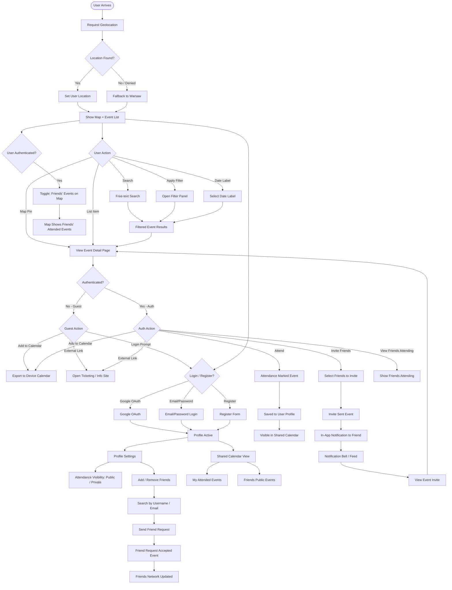

# MVP Definition: Event Search App

## 1. Problem Statement

**What is the core problem that this project aims to solve?**

Finding local events in Poland is fragmented — information is scattered across social media, ticketing platforms, and city portals. There is no single, clean place to discover what's happening nearby, plan around Polish holidays, and coordinate attendance with friends.

## 2. Target Audience & Early Adopters

**Primary Users:** Polish residents looking to discover local events (concerts, festivals, cultural events, sports, etc.) in their vicinity.

**Early Adopters:** Socially active individuals in Polish cities who want to coordinate event attendance with their friend group and stay informed about upcoming local happenings, especially around Polish bank holidays (e.g., Majówka).

## 3. Value Proposition

The app provides a single, clean interface to discover events happening in Poland — filtered by location, date, and category — with no need to navigate ticketing platforms or social media. The quick-access date labels (including dynamic Polish bank holiday shortcuts like "Majówka") make it trivially easy to find events around upcoming days off.

Authenticated users gain a social layer: they can mark attendance, see which friends are going, invite friends, and maintain a shared event calendar. Guest users can still browse and add events to their personal calendar, lowering the barrier to first use.

## 4. Core Features (The "Minimum" in MVP)

### Authentication & Access Levels

- **Guest (unauthenticated):** Browse events, filter, view map, view event details, add events to device calendar
- **Authenticated user:** All guest features + mark attendance (saved to profile), add friends, see friends' attendance, invite friends to events, add new events, shared calendar, privacy toggle for attendance visibility

- **Auth methods:** Google OAuth, Facebook OAuth, email/password
- **Admin role:** Admins create and manage events (user-created events are a future iteration)

### Event Discovery & Search

- **Geolocation:** App requests location permission on first load; defaults to Warsaw if permission is denied or geolocation fails
- **Scope:** Poland only (MVP)
- **Map view:** Interactive map (primary discovery mode) with event pins; authenticated users can toggle a filter to show only events their friends are attending
- **List view:** Scrollable list alongside the map
- **Search bar:** Free-text search by event name, venue, city, or keywords

### Filters

- **Category** (e.g., Concert, Festival, Sports, Culture, Theatre, Food & Drink)
- **Date range** (custom date picker)
- **Distance radius** from detected/selected location

### Quick Date Labels

Static labels always available:

- **Today**
- **Tomorrow**
- **This Weekend** (nearest Saturday–Sunday)
- **Next Weekend**

Dynamic labels for upcoming Polish bank holidays (auto-generated based on the Polish public holiday calendar):

- Shown when a bank holiday or holiday cluster is within the next 60 days
- Example: **Majówka** (May 1–3 cluster), **Boże Ciało**, **Święto Niepodległości**, etc.
- Label triggers a date filter for the relevant holiday period

### Event Detail Page

- Event name, description, date & time, location (address + map pin)
- Category tag(s), keyword tags, and organizer info
- **Attendee count** — visible to all users (integer count only)
- **Friends attending** — visible only to authenticated users (shows friend names/avatars)
- **External link** — "Get Tickets / More Info" button linking to the organizer's platform (Ticketmaster, Eventbrite, Facebook Event, etc.)
- **Add to Calendar** — exports event to device calendar (no auth required)
- **Attend** button — authenticated users only; marks attendance and saves to profile
- **Invite Friends** — authenticated users only; sends an in-app notification to selected friends

### Social Features

- **Friends system:** Add friends by username/email search; friend requests require acceptance
- **Attendance visibility toggle:** Users can set their attendance as public (friends can see) or private (hidden), configurable per-event or globally in profile settings
- **Shared calendar:** Authenticated users see a personal calendar view populated with events they are attending and events their friends (with public attendance) are attending
- **Friend invites:** Inviting a friend to an event triggers an in-app notification for the invited user

### Notifications (MVP scope)

- **Event invite notification** — triggered when a friend invites a user to an event
- Notification visible in-app (notification bell / feed)
- No push or email notifications for MVP; extended notification options are a future iteration

### Admin Event Management

- Admin panel (internal/simple) for creating, editing, and deleting events
- Event fields: name, description, category, date & time, address, external link, optional image, keywords
- **Keywords:** Free-form tags added manually by the creator; an "Generate with AI" button uses an LLM to suggest keywords derived from the event name and description — the creator can accept, edit, or discard suggestions before saving

## 5. "Measure" — Key Metrics for Success

- **500 event detail page views in the first two weeks** — indicates organic discovery usage
- **100 registered accounts in the first month** — baseline for social feature adoption
- **Average session length ≥ 3 minutes** — indicator that users are genuinely exploring events, not bouncing
- **Friend invite conversion rate ≥ 20%** — % of invites that result in the invited user marking attendance

## 6. "Learn" — Feedback and Iteration Plan

- **In-app feedback button** on every event detail page ("Was this info helpful?")
- **Early adopter outreach** — share direct links with socially active users in Warsaw, Kraków, and Trójmiasto for initial testing
- **Analytics events** — track: search queries, filter combinations used, date label clicks (especially holiday labels), attend clicks, invite sends
- Feedback reviewed bi-weekly to prioritize: user-generated events feature, additional notification types, and extended social features

## 7. Assumptions

- **Geolocation adoption** — Most users will grant location permission; Warsaw fallback covers cases where they don't
- **Admin content sufficiency** — Manually curated events will be enough to demonstrate value before user-generated events are built
- **Polish holiday calendar accuracy** — Dynamic holiday labels will correctly identify upcoming Polish bank holidays and cluster them appropriately (e.g., Majówka as May 1–3)
- **External link sufficiency** — Users accept being redirected to external platforms for ticketing; no in-app purchasing is needed for MVP
- **Social opt-in** — Users will be willing to share attendance with friends; the privacy toggle will adequately address concerns
- **Map as primary UX** — Users prefer discovering events spatially on a map rather than purely through list/search
- **Friend network cold-start** — Early users will have enough mutual connections to make social features immediately useful, or will find solo discovery valuable enough to retain them until their network grows

## 8. User Flow Diagrams

### Event Storming User Flow

