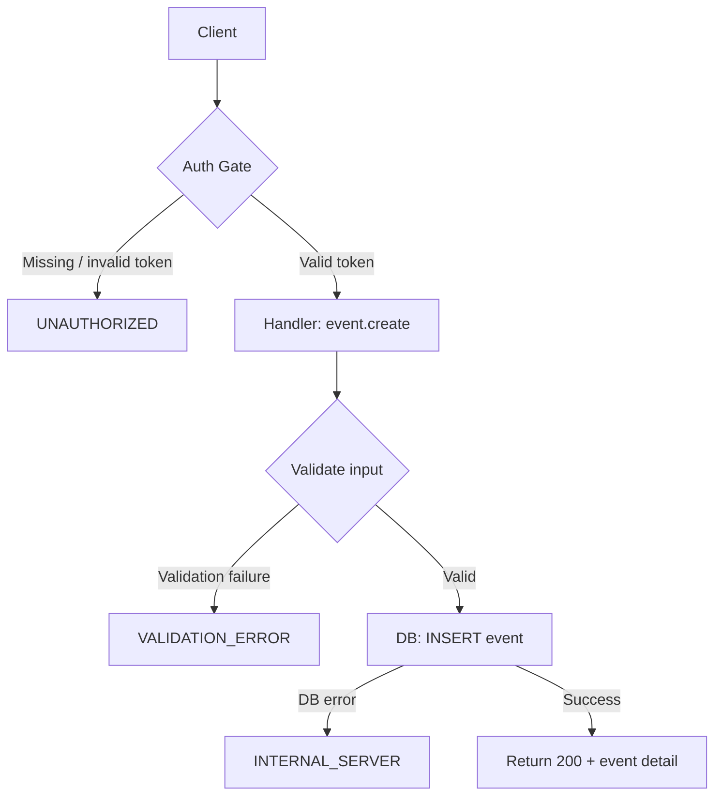
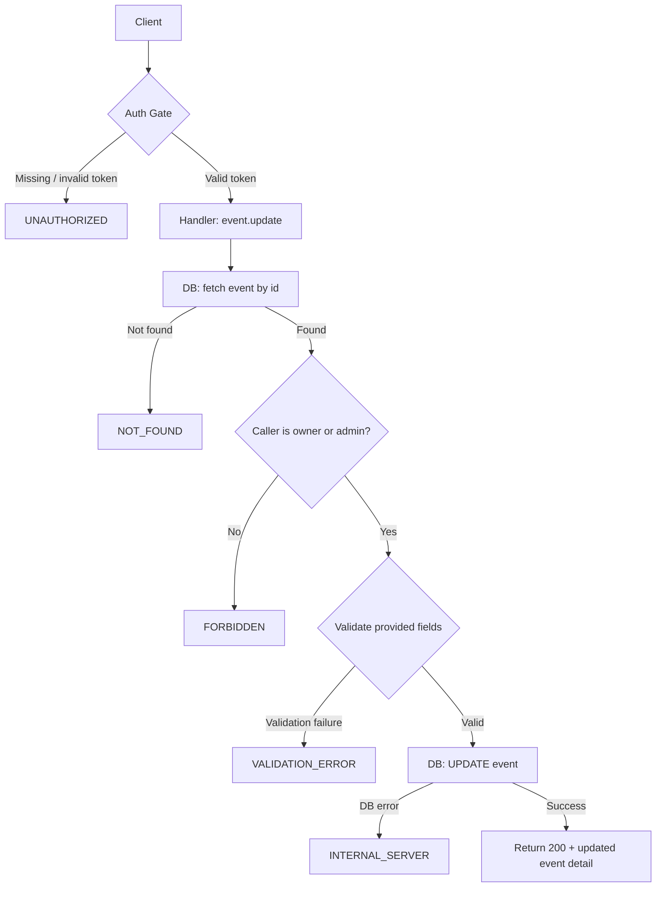
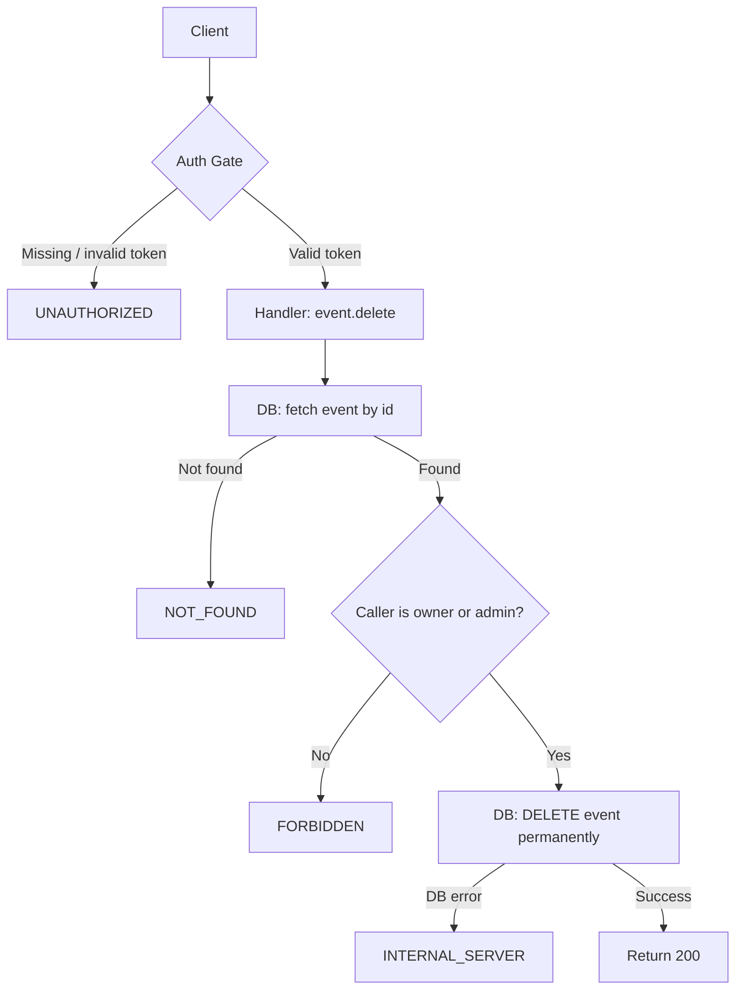
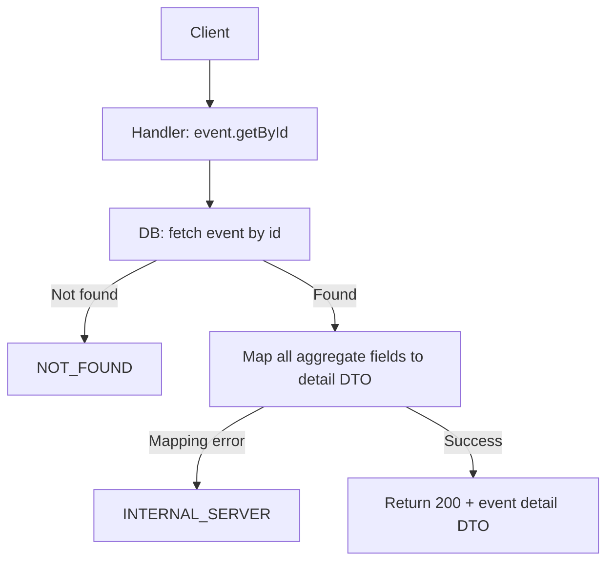
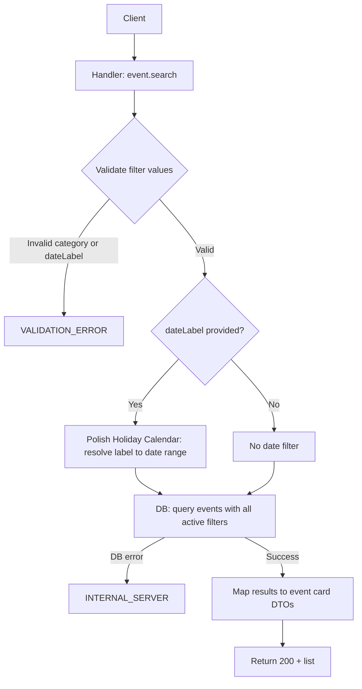
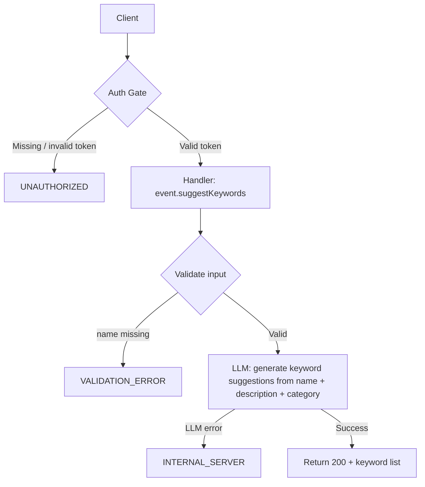
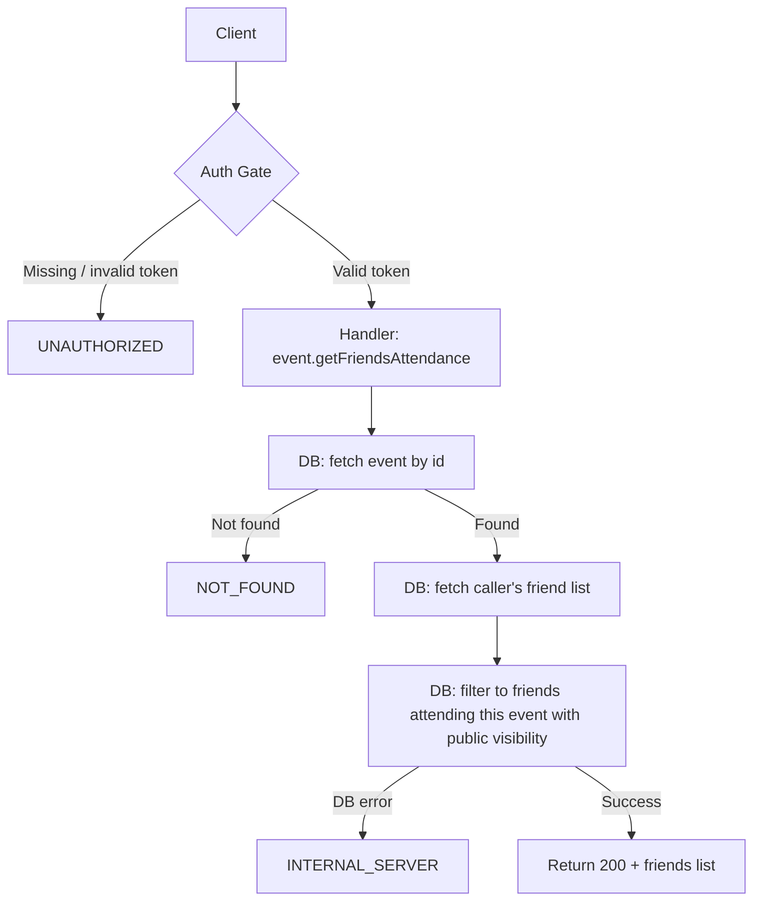

# Event Catalog & Event Discovery — Backend API Plan

API Style: RPC

---

## Section 1 — Flow Diagrams

### event.create



### event.update



### event.delete



### event.getById



### event.search



### event.suggestKeywords



### event.getFriendsAttendance



---

## Section 2 — Procedure Index

| Procedure                  | Auth     | Summary                                                      |
| -------------------------- | -------- | ------------------------------------------------------------ |
| event.create               | Required | Create a new event with full attribute data                  |
| event.update               | Required | Update own event fields (or any event as admin)              |
| event.delete               | Required | Permanently delete own event (or any event as admin)         |
| event.getById              | None     | Fetch full event detail — accessible to all including guests |
| event.search               | None     | Search and filter events by name, category, city, date label |
| event.suggestKeywords      | Required | Get LLM-assisted keyword suggestions based on event context  |
| event.getFriendsAttendance | Required | Get list of friends attending a given event                  |

---

## Section 3 — Procedure Behaviors

### event.create

```
Function Name: event.create
Auth: context token required → UNAUTHORIZED if missing or invalid
Input: name, category, startDateTime, address (street, number, postalCode, city),
       coordinates (lat, lng), endDateTime (optional), externalLink (optional),
       imageUrl (optional), keywords (optional list), organizerInfo (optional)
Output: created event detail including generated id and all submitted fields
Throw Errors When:
- token absent or invalid → UNAUTHORIZED
- required field missing or blank → VALIDATION_ERROR
- category not in allowed taxonomy (Concert, Festival, Sports, Culture, Theatre, Food & Drink) → VALIDATION_ERROR
- startDateTime is not a valid datetime → VALIDATION_ERROR
- DB write fails → INTERNAL_SERVER
Flow: verify auth token
      → validate all fields, collect all violations
      → INSERT event record with caller as owner
      → return 200 + full event detail
```

### event.update

```
Function Name: event.update
Auth: context token required → UNAUTHORIZED if missing or invalid
Input: eventId, plus any subset of: name, category, startDateTime, endDateTime,
       address (street, number, postalCode, city), coordinates (lat, lng),
       externalLink, imageUrl, keywords, organizerInfo
Output: updated event detail with all current field values
Throw Errors When:
- token absent or invalid → UNAUTHORIZED
- event not found by eventId → NOT_FOUND
- caller is neither event owner nor admin → FORBIDDEN
- any provided field fails validation → VALIDATION_ERROR
- DB write fails → INTERNAL_SERVER
Flow: verify auth token
      → fetch event by eventId → if not found → NOT_FOUND
      → check caller is owner or has admin role → if not → FORBIDDEN
      → validate all provided fields
      → UPDATE event record with changed fields only
      → return 200 + updated event detail
```

### event.delete

```
Function Name: event.delete
Auth: context token required → UNAUTHORIZED if missing or invalid
Input: eventId
Output: confirmation of permanent deletion
Throw Errors When:
- token absent or invalid → UNAUTHORIZED
- event not found by eventId → NOT_FOUND
- caller is neither event owner nor admin → FORBIDDEN
- DB delete fails → INTERNAL_SERVER
Flow: verify auth token
      → fetch event by eventId → if not found → NOT_FOUND
      → check caller is owner or has admin role → if not → FORBIDDEN
      → DELETE event record permanently (no soft delete, no recovery)
      → return 200
```

### event.getById

```
Function Name: event.getById
Auth: none — accessible to all users including guests
Input: eventId
Output: full event detail — name, description, category, startDateTime, endDateTime,
        address, externalLink, imageUrl, keywords, organizerInfo, attendeeCount
Throw Errors When:
- event not found by eventId → NOT_FOUND
- DB read fails → INTERNAL_SERVER
Flow: fetch event by eventId → if not found → NOT_FOUND
      → map all aggregate fields to detail DTO
      → return 200 + detail DTO
```

### event.search

```
Function Name: event.search
Auth: none — accessible to all users including guests
Input: name (optional, free text), category (optional, one of taxonomy values),
       city (optional, specific city name or "Cała Polska" which means no city filter),
       dateLabel (optional, preset label string), offset (optional), limit (optional)
Output: list of event card DTOs — each with id, name, category, startDateTime, city;
        total count of matching events
Throw Errors When:
- category provided but not in allowed taxonomy → VALIDATION_ERROR
- dateLabel provided but not a recognized label → VALIDATION_ERROR
- DB read fails → INTERNAL_SERVER
Flow: validate provided filter values
      → if dateLabel provided → resolve to concrete date range via Polish Holiday Calendar domain
      → query events applying all active filters simultaneously
      → apply offset and limit for pagination
      → map results to event card DTOs
      → return 200 + list + total count
```

### event.suggestKeywords

```
Function Name: event.suggestKeywords
Auth: context token required → UNAUTHORIZED if missing or invalid
Input: name, description (optional), category (optional, one of taxonomy values)
Output: list of suggested keyword strings
Throw Errors When:
- token absent or invalid → UNAUTHORIZED
- name field absent or blank → VALIDATION_ERROR
- LLM service call fails → INTERNAL_SERVER
Flow: verify auth token
      → validate input — name is required
      → call LLM service with name, description, category as context
      → parse and normalize keyword suggestions from LLM response
      → return 200 + keyword list
```

### event.getFriendsAttendance

```
Function Name: event.getFriendsAttendance
Auth: context token required → UNAUTHORIZED if missing or invalid
Input: eventId
Output: list of friends attending — each with displayName and avatarUrl
Throw Errors When:
- token absent or invalid → UNAUTHORIZED
- event not found by eventId → NOT_FOUND
- DB read fails → INTERNAL_SERVER
Flow: verify auth token
      → fetch event by eventId → if not found → NOT_FOUND
      → fetch caller's friend list from Social domain
      → filter to friends who have an attendance record for this event
        and whose attendance visibility is public
      → map to friend display DTOs (displayName, avatarUrl)
      → return 200 + friends list (empty list if none)
```

---

## Section 4 — Server-Contract Zod Schemas

### event.create

```ts
import z from 'zod';

const category = z.enum([
  'Concert',
  'Festival',
  'Sports',
  'Culture',
  'Theatre',
  'Food & Drink',
]);

const address = z.object({
  street: z.string().min(1),
  number: z.string().min(1),
  postalCode: z.string().min(1),
  city: z.string().min(1),
});

const coordinates = z.object({
  lat: z.number(),
  lng: z.number(),
});

const eventDetail = z.object({
  id: z.string(),
  name: z.string(),
  description: z.string().optional(),
  category,
  startDateTime: z.string().datetime(),
  endDateTime: z.string().datetime().optional(),
  address,
  coordinates,
  externalLink: z.string().url().optional(),
  imageUrl: z.string().url().optional(),
  keywords: z.array(z.string()),
  organizerInfo: z.string().optional(),
  attendeeCount: z.number().int(),
});

export const schema = () =>
  z.object({
    in: z.object({
      name: z.string().min(1),
      category,
      startDateTime: z.string().datetime(),
      endDateTime: z.string().datetime().optional(),
      address,
      coordinates,
      externalLink: z.string().url().optional(),
      imageUrl: z.string().url().optional(),
      keywords: z.array(z.string()).optional(),
      organizerInfo: z.string().optional(),
    }),
    out: z.union([
      z.object({
        code: z.literal(200),
        event: eventDetail,
      }),
      z.object({
        code: z.literal(400),
        type: z.literal('bad-request'),
        message: z.string(),
      }),
      z.object({
        code: z.literal(401),
        type: z.literal('unauthorized'),
        message: z.string(),
      }),
      z.object({
        code: z.literal(500),
        type: z.literal('internal-server'),
        message: z.string(),
      }),
    ]),
  });

export type Schema = z.infer<ReturnType<typeof schema>>;
```

### event.update

```ts
import z from 'zod';

const category = z.enum([
  'Concert',
  'Festival',
  'Sports',
  'Culture',
  'Theatre',
  'Food & Drink',
]);

const address = z.object({
  street: z.string().min(1),
  number: z.string().min(1),
  postalCode: z.string().min(1),
  city: z.string().min(1),
});

const coordinates = z.object({
  lat: z.number(),
  lng: z.number(),
});

export const schema = () =>
  z.object({
    in: z.object({
      eventId: z.string(),
      name: z.string().min(1).optional(),
      category: category.optional(),
      startDateTime: z.string().datetime().optional(),
      endDateTime: z.string().datetime().optional(),
      address: address.optional(),
      coordinates: coordinates.optional(),
      externalLink: z.string().url().optional(),
      imageUrl: z.string().url().optional(),
      keywords: z.array(z.string()).optional(),
      organizerInfo: z.string().optional(),
    }),
    out: z.union([
      z.object({
        code: z.literal(200),
        event: z.object({
          id: z.string(),
          name: z.string(),
          description: z.string().optional(),
          category,
          startDateTime: z.string().datetime(),
          endDateTime: z.string().datetime().optional(),
          address,
          coordinates,
          externalLink: z.string().url().optional(),
          imageUrl: z.string().url().optional(),
          keywords: z.array(z.string()),
          organizerInfo: z.string().optional(),
          attendeeCount: z.number().int(),
        }),
      }),
      z.object({
        code: z.literal(400),
        type: z.literal('bad-request'),
        message: z.string(),
      }),
      z.object({
        code: z.literal(401),
        type: z.literal('unauthorized'),
        message: z.string(),
      }),
      z.object({
        code: z.literal(403),
        type: z.literal('forbidden'),
        message: z.string(),
      }),
      z.object({
        code: z.literal(404),
        type: z.literal('not-found'),
        message: z.string(),
      }),
      z.object({
        code: z.literal(500),
        type: z.literal('internal-server'),
        message: z.string(),
      }),
    ]),
  });

export type Schema = z.infer<ReturnType<typeof schema>>;
```

### event.delete

```ts
import z from 'zod';

export const schema = () =>
  z.object({
    in: z.object({
      eventId: z.string(),
    }),
    out: z.union([
      z.object({
        code: z.literal(200),
      }),
      z.object({
        code: z.literal(401),
        type: z.literal('unauthorized'),
        message: z.string(),
      }),
      z.object({
        code: z.literal(403),
        type: z.literal('forbidden'),
        message: z.string(),
      }),
      z.object({
        code: z.literal(404),
        type: z.literal('not-found'),
        message: z.string(),
      }),
      z.object({
        code: z.literal(500),
        type: z.literal('internal-server'),
        message: z.string(),
      }),
    ]),
  });

export type Schema = z.infer<ReturnType<typeof schema>>;
```

### event.getById

```ts
import z from 'zod';

const category = z.enum([
  'Concert',
  'Festival',
  'Sports',
  'Culture',
  'Theatre',
  'Food & Drink',
]);

export const schema = () =>
  z.object({
    in: z.object({
      eventId: z.string(),
    }),
    out: z.union([
      z.object({
        code: z.literal(200),
        event: z.object({
          id: z.string(),
          name: z.string(),
          description: z.string().optional(),
          category,
          startDateTime: z.string().datetime(),
          endDateTime: z.string().datetime().optional(),
          address: z.object({
            street: z.string(),
            number: z.string(),
            postalCode: z.string(),
            city: z.string(),
          }),
          coordinates: z.object({
            lat: z.number(),
            lng: z.number(),
          }),
          externalLink: z.string().url().optional(),
          imageUrl: z.string().url().optional(),
          keywords: z.array(z.string()),
          organizerInfo: z.string().optional(),
          attendeeCount: z.number().int(),
        }),
      }),
      z.object({
        code: z.literal(404),
        type: z.literal('not-found'),
        message: z.string(),
      }),
      z.object({
        code: z.literal(500),
        type: z.literal('internal-server'),
        message: z.string(),
      }),
    ]),
  });

export type Schema = z.infer<ReturnType<typeof schema>>;
```

### event.search

```ts
import z from 'zod';

const category = z.enum([
  'Concert',
  'Festival',
  'Sports',
  'Culture',
  'Theatre',
  'Food & Drink',
]);

export const schema = () =>
  z.object({
    in: z.object({
      name: z.string().optional(),
      category: category.optional(),
      city: z.string().optional(),
      dateLabel: z.string().optional(),
      offset: z.number().int().min(0).optional(),
      limit: z.number().int().min(1).max(100).optional(),
    }),
    out: z.union([
      z.object({
        code: z.literal(200),
        events: z.array(
          z.object({
            id: z.string(),
            name: z.string(),
            category,
            startDateTime: z.string().datetime(),
            city: z.string(),
          }),
        ),
        total: z.number().int(),
      }),
      z.object({
        code: z.literal(400),
        type: z.literal('bad-request'),
        message: z.string(),
      }),
      z.object({
        code: z.literal(500),
        type: z.literal('internal-server'),
        message: z.string(),
      }),
    ]),
  });

export type Schema = z.infer<ReturnType<typeof schema>>;
```

### event.suggestKeywords

```ts
import z from 'zod';

const category = z.enum([
  'Concert',
  'Festival',
  'Sports',
  'Culture',
  'Theatre',
  'Food & Drink',
]);

export const schema = () =>
  z.object({
    in: z.object({
      name: z.string().min(1),
      description: z.string().optional(),
      category: category.optional(),
    }),
    out: z.union([
      z.object({
        code: z.literal(200),
        keywords: z.array(z.string()),
      }),
      z.object({
        code: z.literal(400),
        type: z.literal('bad-request'),
        message: z.string(),
      }),
      z.object({
        code: z.literal(401),
        type: z.literal('unauthorized'),
        message: z.string(),
      }),
      z.object({
        code: z.literal(500),
        type: z.literal('internal-server'),
        message: z.string(),
      }),
    ]),
  });

export type Schema = z.infer<ReturnType<typeof schema>>;
```

### event.getFriendsAttendance

```ts
import z from 'zod';

export const schema = () =>
  z.object({
    in: z.object({
      eventId: z.string(),
    }),
    out: z.union([
      z.object({
        code: z.literal(200),
        friends: z.array(
          z.object({
            displayName: z.string(),
            avatarUrl: z.string().url().optional(),
          }),
        ),
      }),
      z.object({
        code: z.literal(401),
        type: z.literal('unauthorized'),
        message: z.string(),
      }),
      z.object({
        code: z.literal(404),
        type: z.literal('not-found'),
        message: z.string(),
      }),
      z.object({
        code: z.literal(500),
        type: z.literal('internal-server'),
        message: z.string(),
      }),
    ]),
  });

export type Schema = z.infer<ReturnType<typeof schema>>;
```
