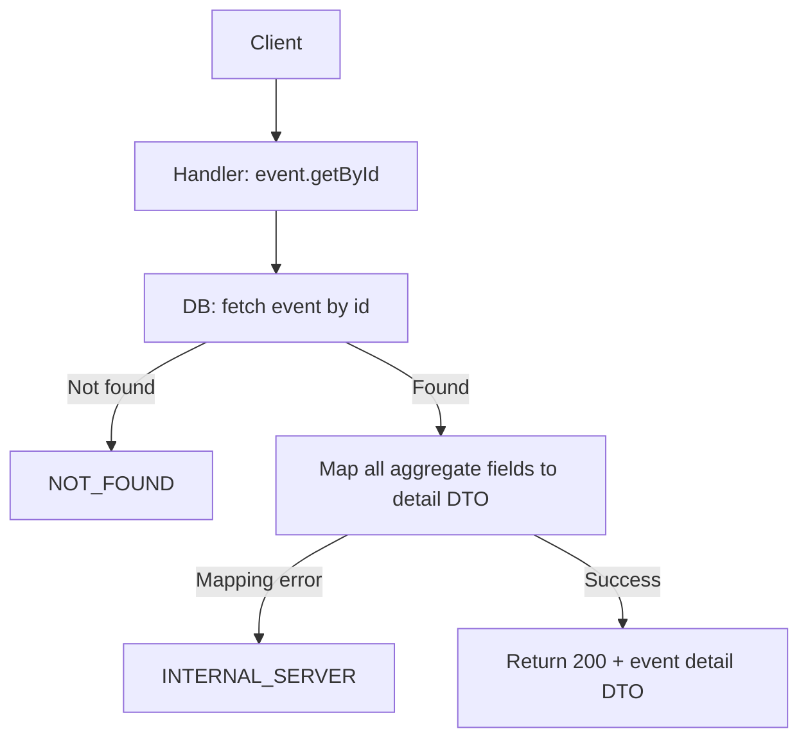
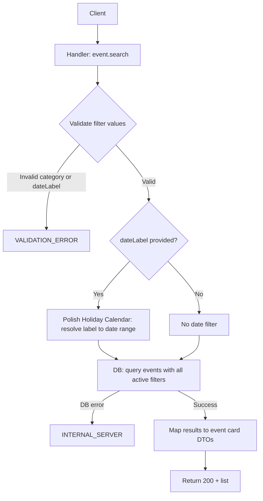

# Event Discovery — Backend API Plan

API Style: RPC

---

## Section 1 — Flow Diagrams

### event.getById



### event.search



---

## Section 2 — Procedure Index

| Procedure     | Auth | Summary                                                      |
| ------------- | ---- | ------------------------------------------------------------ |
| event.getById | None | Fetch full event detail — accessible to all including guests |
| event.search  | None | Search and filter events by name, category, city, date label |

---

## Section 3 — Procedure Behaviors

### event.getById

```
Function Name: event.getById
Auth: none — accessible to all users including guests
Input: eventId
Output: full event detail — name, description, category, startDateTime, endDateTime,
        address, externalLink, imageUrl, keywords, organizerInfo, attendeeCount
Throw Errors When:
- event not found by eventId → NOT_FOUND
- DB read fails → INTERNAL_SERVER
Flow: fetch event by eventId → if not found → NOT_FOUND
      → map all aggregate fields to detail DTO
      → return 200 + detail DTO
```

### event.search

```
Function Name: event.search
Auth: none — accessible to all users including guests
Input: name (optional, free text), category (optional, one of taxonomy values),
       city (optional, specific city name or "Cała Polska" which means no city filter),
       dateLabel (optional, preset label string), offset (optional), limit (optional)
Output: list of event card DTOs — each with id, name, category, startDateTime, city;
        total count of matching events
Throw Errors When:
- category provided but not in allowed taxonomy → VALIDATION_ERROR
- dateLabel provided but not a recognized label → VALIDATION_ERROR
- DB read fails → INTERNAL_SERVER
Flow: validate provided filter values
      → if dateLabel provided → resolve to concrete date range via Polish Holiday Calendar domain
      → query events applying all active filters simultaneously
      → apply offset and limit for pagination
      → map results to event card DTOs
      → return 200 + list + total count
```

---

## Section 4 — Server-Contract Zod Schemas

### event.getById

```ts
import z from 'zod';

const category = z.enum([
  'concert',
  'festival',
  'sports',
  'culture',
  'theatre',
  'food_and_drink',
]);

export const schema = () =>
  z.object({
    in: z.object({
      eventId: z.string(),
    }),
    out: z.union([
      z.object({
        code: z.literal(200),
        event: z.object({
          id: z.string(),
          name: z.string(),
          description: z.string().optional(),
          category,
          startDateTime: z.string().datetime(),
          endDateTime: z.string().datetime().optional(),
          address: z.object({
            street: z.string(),
            number: z.string(),
            postalCode: z.string(),
            city: z.string(),
          }),
          coordinates: z.object({
            lat: z.number(),
            lng: z.number(),
          }),
          externalLink: z.string().url().optional(),
          imageUrl: z.string().url().optional(),
          keywords: z.array(z.string()),
          organizerInfo: z.string().optional(),
          attendeeCount: z.number().int(),
        }),
      }),
      z.object({
        code: z.literal(404),
        type: z.literal('not-found'),
        message: z.string(),
      }),
      z.object({
        code: z.literal(500),
        type: z.literal('internal-server'),
        message: z.string(),
      }),
    ]),
  });

export type Schema = z.infer<ReturnType<typeof schema>>;
```

### event.search

```ts
import z from 'zod';

const category = z.enum([
  'concert',
  'festival',
  'sports',
  'culture',
  'theatre',
  'food_and_drink',
]);

export const schema = () =>
  z.object({
    in: z.object({
      name: z.string().optional(),
      category: category.optional(),
      city: z.string().optional(),
      dateLabel: z.string().optional(),
      offset: z.number().int().min(0).optional(),
      limit: z.number().int().min(1).max(100).optional(),
    }),
    out: z.union([
      z.object({
        code: z.literal(200),
        events: z.array(
          z.object({
            id: z.string(),
            name: z.string(),
            category,
            startDateTime: z.string().datetime(),
            city: z.string(),
          }),
        ),
        total: z.number().int(),
      }),
      z.object({
        code: z.literal(400),
        type: z.literal('bad-request'),
        message: z.string(),
      }),
      z.object({
        code: z.literal(500),
        type: z.literal('internal-server'),
        message: z.string(),
      }),
    ]),
  });

export type Schema = z.infer<ReturnType<typeof schema>>;
```
