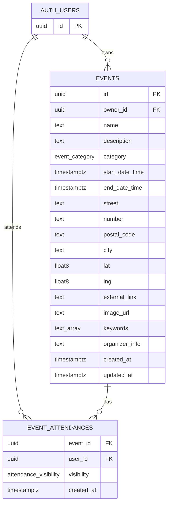

---

### helpers

```sql
-- Assumption: pg_trgm is available in Supabase (enabled by default)
CREATE EXTENSION IF NOT EXISTS pg_trgm;

CREATE TYPE event_category AS ENUM (
  'concert', 'festival', 'sports', 'culture', 'theatre', 'food_and_drink'
);

CREATE TYPE attendance_visibility AS ENUM ('public', 'private');

CREATE OR REPLACE FUNCTION set_updated_at()
RETURNS TRIGGER LANGUAGE plpgsql SECURITY DEFINER AS $$
BEGIN
  NEW.updated_at = now();
  RETURN NEW;
END;
$$;

-- rollback: DROP FUNCTION set_updated_at(); DROP TYPE attendance_visibility; DROP TYPE event_category; DROP EXTENSION pg_trgm;
```

### 001_events

```sql
CREATE TABLE events (
  id              uuid PRIMARY KEY DEFAULT gen_random_uuid(),
  owner_id        uuid NOT NULL REFERENCES auth.users(id) ON DELETE CASCADE,
  name            text NOT NULL,
  description     text,
  category        event_category NOT NULL,
  start_date_time timestamptz NOT NULL,
  end_date_time   timestamptz,
  street          text NOT NULL,
  number          text NOT NULL,
  postal_code     text NOT NULL,
  city            text NOT NULL,
  lat             double precision NOT NULL,
  lng             double precision NOT NULL,
  external_link   text,
  image_url       text,
  keywords        text[] NOT NULL DEFAULT '{}',
  organizer_info  text,
  created_at      timestamptz NOT NULL DEFAULT now(),
  updated_at      timestamptz NOT NULL DEFAULT now(),

  CONSTRAINT events_end_after_start CHECK (end_date_time IS NULL OR end_date_time > start_date_time)
);

CREATE INDEX ON events (owner_id);
CREATE INDEX ON events (category);
CREATE INDEX ON events (city);
CREATE INDEX ON events (start_date_time);
CREATE INDEX ON events (category, city, start_date_time); -- combined search filter
CREATE INDEX ON events USING gin (name gin_trgm_ops);     -- free-text name filter (event.search)
CREATE INDEX ON events USING gin (keywords);              -- keyword array lookups

CREATE TRIGGER events_set_updated_at
  BEFORE UPDATE ON events
  FOR EACH ROW EXECUTE FUNCTION set_updated_at();

ALTER TABLE events ENABLE ROW LEVEL SECURITY;

-- all users (anon + authenticated) can read events
CREATE POLICY "events_select_all"
  ON events FOR SELECT
  USING (true);

-- authenticated users can insert their own events
CREATE POLICY "events_insert_authenticated"
  ON events FOR INSERT
  WITH CHECK (auth.uid() IS NOT NULL AND auth.uid() = owner_id);

-- Assumption: admin role is stored in Supabase auth.jwt() app_metadata as { "role": "admin" }
CREATE POLICY "events_update_owner_or_admin"
  ON events FOR UPDATE
  USING (
    auth.uid() = owner_id
    OR (auth.jwt() -> 'app_metadata' ->> 'role') = 'admin'
  )
  WITH CHECK (
    auth.uid() = owner_id
    OR (auth.jwt() -> 'app_metadata' ->> 'role') = 'admin'
  );

CREATE POLICY "events_delete_owner_or_admin"
  ON events FOR DELETE
  USING (
    auth.uid() = owner_id
    OR (auth.jwt() -> 'app_metadata' ->> 'role') = 'admin'
  );

-- rollback: DROP TABLE events;
```

### 002_event_attendances

```sql
-- FK cross-ref: events.id
CREATE TABLE event_attendances (
  event_id    uuid NOT NULL REFERENCES events(id) ON DELETE CASCADE,
  user_id     uuid NOT NULL REFERENCES auth.users(id) ON DELETE CASCADE,
  visibility  attendance_visibility NOT NULL DEFAULT 'public',
  created_at  timestamptz NOT NULL DEFAULT now(),
  PRIMARY KEY (event_id, user_id)
);

CREATE INDEX ON event_attendances (user_id);
-- partial index: event.getFriendsAttendance filters to public visibility only
CREATE INDEX ON event_attendances (event_id) WHERE visibility = 'public';

ALTER TABLE event_attendances ENABLE ROW LEVEL SECURITY;

-- own attendance always readable; others' only when public
CREATE POLICY "attendance_select"
  ON event_attendances FOR SELECT
  USING (
    user_id = auth.uid()
    OR visibility = 'public'
  );

CREATE POLICY "attendance_insert_own"
  ON event_attendances FOR INSERT
  WITH CHECK (auth.uid() = user_id);

CREATE POLICY "attendance_update_own"
  ON event_attendances FOR UPDATE
  USING (auth.uid() = user_id)
  WITH CHECK (auth.uid() = user_id);

CREATE POLICY "attendance_delete_own"
  ON event_attendances FOR DELETE
  USING (auth.uid() = user_id);

-- rollback: DROP TABLE event_attendances;
```
