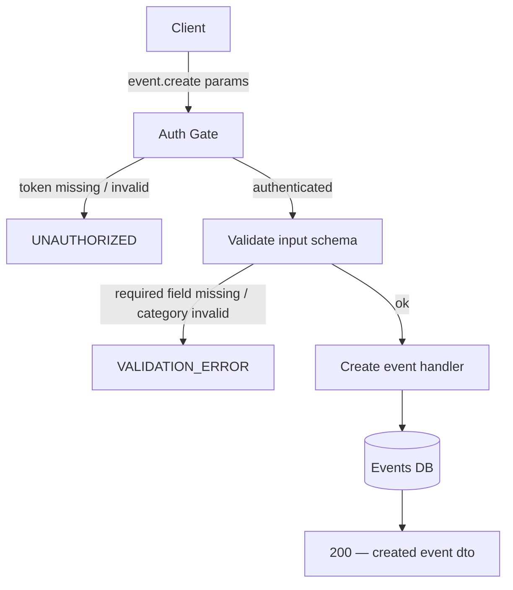
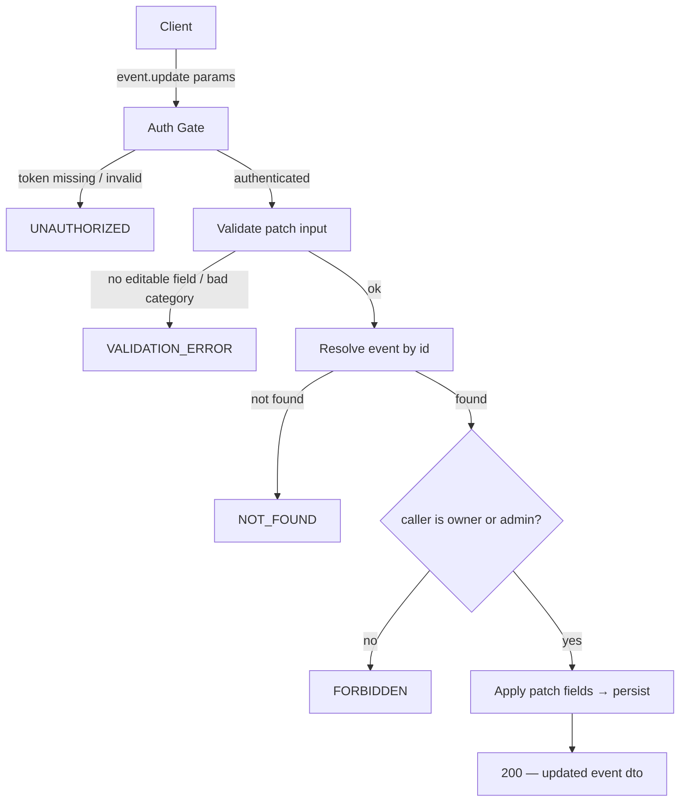
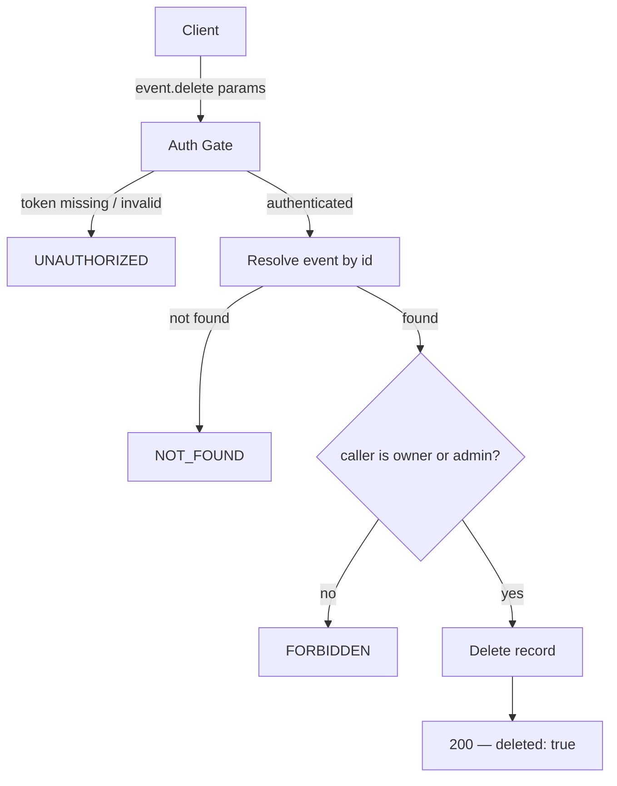
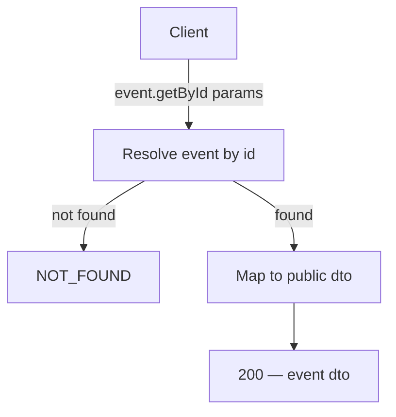
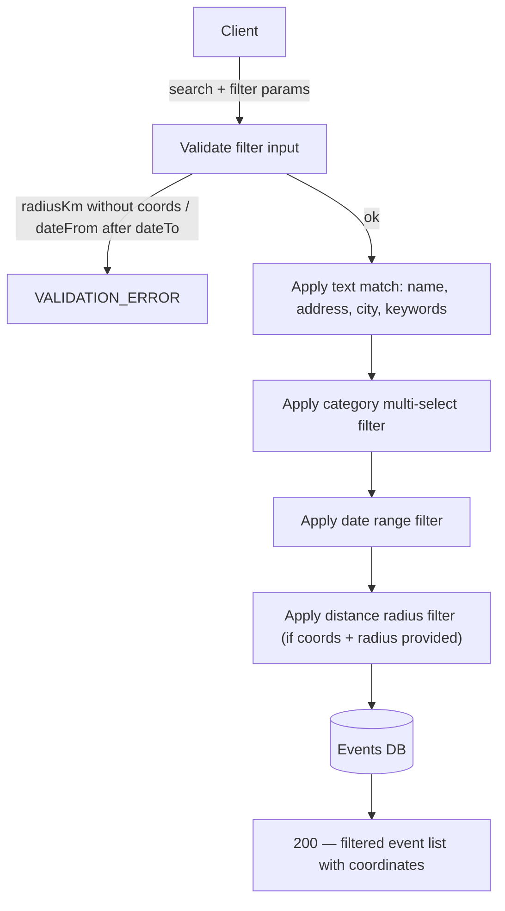
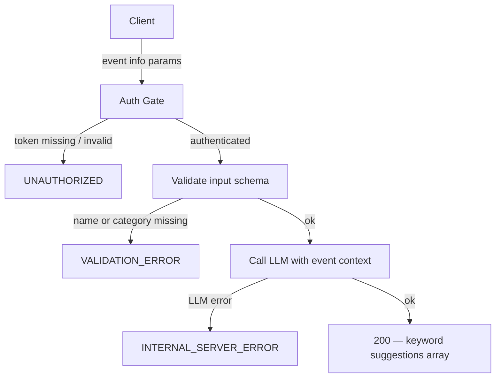
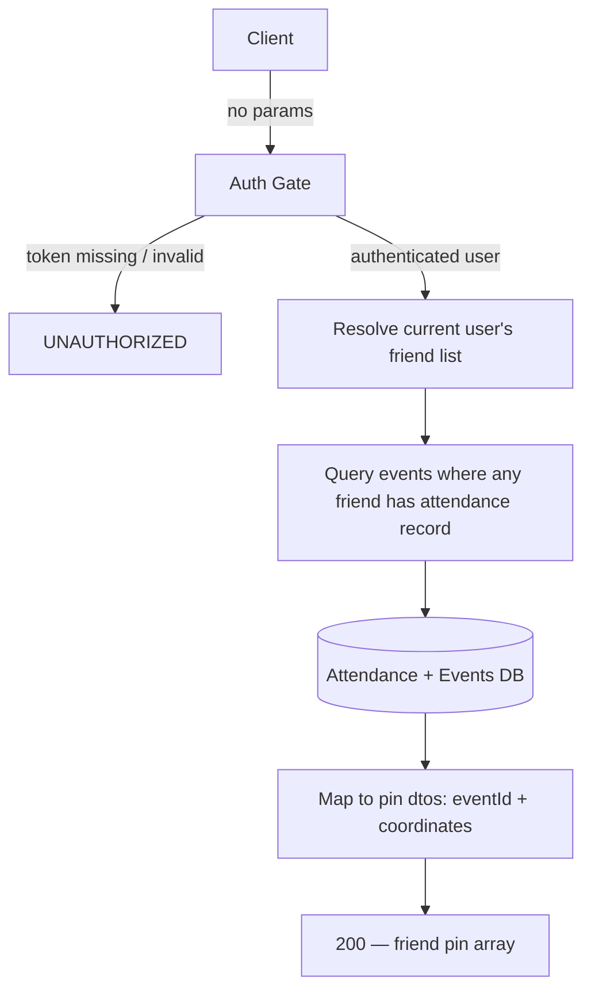

# Event Module — Backend API Plan (RPC)

## Section 1 — Flow Diagrams

### event.create



### event.update



### event.delete



### event.getById



### event.search



### event.suggestKeywords



### event.getFriendsAttendance



---

## Section 2 — Endpoint Index

| Procedure                    | Auth                   | Summary                                                               |
| ---------------------------- | ---------------------- | --------------------------------------------------------------------- |
| `event.create`               | AuthUser               | Create a new event record                                             |
| `event.update`               | AuthUser (owner/admin) | Edit any field of an existing event                                   |
| `event.delete`               | AuthUser (owner/admin) | Remove an event permanently                                           |
| `event.getById`              | None                   | Fetch a single event by ID                                            |
| `event.search`               | None                   | Search and filter events for map and list views                       |
| `event.suggestKeywords`      | AuthUser               | Get LLM-generated keyword suggestions for an event `<dependency:LLM>` |
| `event.getFriendsAttendance` | AuthUser               | Get map pins for events where friends are attending                   |

---

## Section 3 — Endpoint Behaviors

```
### event.create

Function Name: event.create
Auth: authenticated user token required → UNAUTHORIZED if missing or invalid
Input: name, category, datetime, address, coordinates (lat, lng);
       optionally: description, externalLink, image, keywords, organizer (name, contact)
Output: created event dto with system-generated id and all persisted fields
Throw Errors When:
- token missing or invalid → UNAUTHORIZED
- required field absent → VALIDATION_ERROR
- category not in allowed enum → VALIDATION_ERROR
Flow: validate auth → validate input → persist new event record (store caller as owner) → return created event dto
```

```
### event.update

Function Name: event.update
Auth: authenticated user token required → UNAUTHORIZED if missing or invalid → FORBIDDEN if caller is not owner and not admin
Input: id (required); at least one of: name, category, datetime, address, coordinates,
       description, externalLink, image, keywords, organizer
Output: updated event dto with all fields reflecting changes
Throw Errors When:
- token missing or invalid → UNAUTHORIZED
- no editable field provided → VALIDATION_ERROR
- category value outside allowed enum → VALIDATION_ERROR
- event id not found → NOT_FOUND
- caller is not owner and not admin → FORBIDDEN
Flow: validate auth → validate patch input → resolve event by id → check caller is owner or admin → apply patch fields → persist → return updated event dto
```

```
### event.delete

Function Name: event.delete
Auth: authenticated user token required → UNAUTHORIZED if missing or invalid → FORBIDDEN if caller is not owner and not admin
Input: id
Output: confirmation that the event was deleted
Throw Errors When:
- token missing or invalid → UNAUTHORIZED
- event id not found → NOT_FOUND
- caller is not owner and not admin → FORBIDDEN
Flow: validate auth → resolve event by id → check caller is owner or admin → delete record → return deleted: true
```

```
### event.getById

Function Name: event.getById
Auth: none
Input: id
Output: full event dto — name, category, datetime, address, coordinates,
        description?, externalLink?, image?, keywords, organizer?
Throw Errors When:
- event id not found → NOT_FOUND
Flow: resolve event by id → map to dto → return dto
```

```
### event.search

Function Name: event.search
Auth: none
Input: query? (matched against name, address, city, keywords),
       categories? (multi-select enum values),
       dateFrom?, dateTo?,
       latitude?, longitude?, radiusKm?
Output: array of matching event dtos each including coordinates (drives both map pins and list view)
Throw Errors When:
- radiusKm provided without latitude or longitude → VALIDATION_ERROR
- dateFrom is after dateTo → VALIDATION_ERROR
Flow: validate filter input
   → apply text match on name, address, city, keywords
   → apply category multi-select filter (AND logic with other filters)
   → apply date range filter
   → apply distance radius filter (only when latitude, longitude, and radiusKm all present)
   → return filtered event list
```

```
### event.suggestKeywords

Function Name: event.suggestKeywords
Auth: authenticated user token required → UNAUTHORIZED if missing or invalid
Input: name, category; optionally: description, address
Output: array of suggested keyword strings (not yet saved — caller selects before saving)
Throw Errors When:
- token missing or invalid → UNAUTHORIZED
- name or category missing → VALIDATION_ERROR
- LLM call fails → INTERNAL_SERVER_ERROR
Flow: validate auth → validate input → build LLM prompt from event context → call LLM → parse keyword array from response → return suggestions
```

```
### event.getFriendsAttendance

Function Name: event.getFriendsAttendance
Auth: authenticated user token required → UNAUTHORIZED if missing or invalid
Input: none
Output: array of { eventId, coordinates } — one pin per event where at least one friend is attending
Throw Errors When:
- token missing or invalid → UNAUTHORIZED
Flow: validate auth → resolve current user's friend list → query events where any friend has an attendance record → map to pin dtos (eventId + coordinates) → return pins
```

---

## Section 4 — Server-Contract Zod Schemas

### event.create

```ts
import z from 'zod';

const category = z.enum([
  'Concert',
  'Festival',
  'Sports',
  'Culture',
  'Theatre',
  'Food & Drink',
]);
const coordinates = z.object({ lat: z.number(), lng: z.number() });
const organizer = z.object({ name: z.string(), contact: z.string() });

const eventDto = z.object({
  id: z.string(),
  name: z.string(),
  category,
  datetime: z.string().datetime(),
  address: z.string(),
  coordinates,
  description: z.string().optional(),
  externalLink: z.string().optional(),
  image: z.string().optional(),
  keywords: z.array(z.string()),
  organizer: organizer.optional(),
});

export const schema = () =>
  z.object({
    in: z.object({
      name: z.string().min(1),
      category,
      datetime: z.string().datetime(),
      address: z.string().min(1),
      coordinates,
      description: z.string().optional(),
      externalLink: z.string().url().optional(),
      image: z.string().url().optional(),
      keywords: z.array(z.string()).optional(),
      organizer: organizer.optional(),
    }),
    out: z.union([
      z.object({ code: z.literal(200), event: eventDto }),
      z.object({
        code: z.literal(400),
        type: z.literal('validation-error'),
        message: z.string(),
      }),
      z.object({
        code: z.literal(401),
        type: z.literal('unauthorized'),
        message: z.string(),
      }),
      z.object({
        code: z.literal(500),
        type: z.literal('internal-server'),
        message: z.string(),
      }),
    ]),
  });

export type Schema = z.infer<ReturnType<typeof schema>>;
```

### event.update

```ts
import z from 'zod';

const category = z.enum([
  'Concert',
  'Festival',
  'Sports',
  'Culture',
  'Theatre',
  'Food & Drink',
]);
const coordinates = z.object({ lat: z.number(), lng: z.number() });
const organizer = z.object({ name: z.string(), contact: z.string() });

const eventDto = z.object({
  id: z.string(),
  name: z.string(),
  category,
  datetime: z.string().datetime(),
  address: z.string(),
  coordinates,
  description: z.string().optional(),
  externalLink: z.string().optional(),
  image: z.string().optional(),
  keywords: z.array(z.string()),
  organizer: organizer.optional(),
});

export const schema = () =>
  z.object({
    in: z.object({
      id: z.string(),
      name: z.string().optional(),
      category: category.optional(),
      datetime: z.string().datetime().optional(),
      address: z.string().optional(),
      coordinates: coordinates.optional(),
      description: z.string().optional(),
      externalLink: z.string().url().optional(),
      image: z.string().url().optional(),
      keywords: z.array(z.string()).optional(),
      organizer: organizer.optional(),
    }),
    out: z.union([
      z.object({ code: z.literal(200), event: eventDto }),
      z.object({
        code: z.literal(400),
        type: z.literal('validation-error'),
        message: z.string(),
      }),
      z.object({
        code: z.literal(401),
        type: z.literal('unauthorized'),
        message: z.string(),
      }),
      z.object({
        code: z.literal(403),
        type: z.literal('forbidden'),
        message: z.string(),
      }),
      z.object({
        code: z.literal(404),
        type: z.literal('not-found'),
        message: z.string(),
      }),
      z.object({
        code: z.literal(500),
        type: z.literal('internal-server'),
        message: z.string(),
      }),
    ]),
  });

export type Schema = z.infer<ReturnType<typeof schema>>;
```

### event.delete

```ts
import z from 'zod';

export const schema = () =>
  z.object({
    in: z.object({
      id: z.string(),
    }),
    out: z.union([
      z.object({ code: z.literal(200), deleted: z.literal(true) }),
      z.object({
        code: z.literal(401),
        type: z.literal('unauthorized'),
        message: z.string(),
      }),
      z.object({
        code: z.literal(403),
        type: z.literal('forbidden'),
        message: z.string(),
      }),
      z.object({
        code: z.literal(404),
        type: z.literal('not-found'),
        message: z.string(),
      }),
      z.object({
        code: z.literal(500),
        type: z.literal('internal-server'),
        message: z.string(),
      }),
    ]),
  });

export type Schema = z.infer<ReturnType<typeof schema>>;
```

### event.getById

```ts
import z from 'zod';

const category = z.enum([
  'Concert',
  'Festival',
  'Sports',
  'Culture',
  'Theatre',
  'Food & Drink',
]);
const coordinates = z.object({ lat: z.number(), lng: z.number() });
const organizer = z.object({ name: z.string(), contact: z.string() });

export const schema = () =>
  z.object({
    in: z.object({
      id: z.string(),
    }),
    out: z.union([
      z.object({
        code: z.literal(200),
        event: z.object({
          id: z.string(),
          name: z.string(),
          category,
          datetime: z.string().datetime(),
          address: z.string(),
          coordinates,
          description: z.string().optional(),
          externalLink: z.string().optional(),
          image: z.string().optional(),
          keywords: z.array(z.string()),
          organizer: organizer.optional(),
        }),
      }),
      z.object({
        code: z.literal(404),
        type: z.literal('not-found'),
        message: z.string(),
      }),
      z.object({
        code: z.literal(500),
        type: z.literal('internal-server'),
        message: z.string(),
      }),
    ]),
  });

export type Schema = z.infer<ReturnType<typeof schema>>;
```

### event.search

```ts
import z from 'zod';

const category = z.enum([
  'Concert',
  'Festival',
  'Sports',
  'Culture',
  'Theatre',
  'Food & Drink',
]);
const coordinates = z.object({ lat: z.number(), lng: z.number() });
const organizer = z.object({ name: z.string(), contact: z.string() });

export const schema = () =>
  z.object({
    in: z.object({
      query: z.string().optional(),
      categories: z.array(category).optional(),
      dateFrom: z.string().datetime().optional(),
      dateTo: z.string().datetime().optional(),
      latitude: z.number().optional(),
      longitude: z.number().optional(),
      radiusKm: z.number().positive().optional(),
    }),
    out: z.union([
      z.object({
        code: z.literal(200),
        events: z.array(
          z.object({
            id: z.string(),
            name: z.string(),
            category,
            datetime: z.string().datetime(),
            address: z.string(),
            coordinates,
            description: z.string().optional(),
            image: z.string().optional(),
            keywords: z.array(z.string()),
            organizer: organizer.optional(),
          }),
        ),
      }),
      z.object({
        code: z.literal(400),
        type: z.literal('validation-error'),
        message: z.string(),
      }),
      z.object({
        code: z.literal(500),
        type: z.literal('internal-server'),
        message: z.string(),
      }),
    ]),
  });

export type Schema = z.infer<ReturnType<typeof schema>>;
```

### event.suggestKeywords

```ts
import z from 'zod';

const category = z.enum([
  'Concert',
  'Festival',
  'Sports',
  'Culture',
  'Theatre',
  'Food & Drink',
]);

export const schema = () =>
  z.object({
    in: z.object({
      name: z.string().min(1),
      category,
      description: z.string().optional(),
      address: z.string().optional(),
    }),
    out: z.union([
      z.object({ code: z.literal(200), suggestions: z.array(z.string()) }),
      z.object({
        code: z.literal(400),
        type: z.literal('validation-error'),
        message: z.string(),
      }),
      z.object({
        code: z.literal(401),
        type: z.literal('unauthorized'),
        message: z.string(),
      }),
      z.object({
        code: z.literal(500),
        type: z.literal('internal-server'),
        message: z.string(),
      }),
    ]),
  });

export type Schema = z.infer<ReturnType<typeof schema>>;
```

### event.getFriendsAttendance

```ts
import z from 'zod';

export const schema = () =>
  z.object({
    in: z.object({}),
    out: z.union([
      z.object({
        code: z.literal(200),
        pins: z.array(
          z.object({
            eventId: z.string(),
            coordinates: z.object({ lat: z.number(), lng: z.number() }),
          }),
        ),
      }),
      z.object({
        code: z.literal(401),
        type: z.literal('unauthorized'),
        message: z.string(),
      }),
      z.object({
        code: z.literal(500),
        type: z.literal('internal-server'),
        message: z.string(),
      }),
    ]),
  });

export type Schema = z.infer<ReturnType<typeof schema>>;
```
