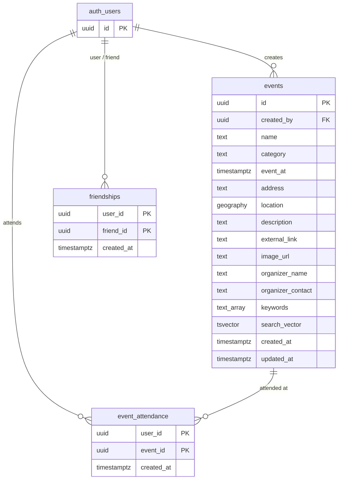

### helpers

```sql
CREATE EXTENSION IF NOT EXISTS postgis;

-- Assumption: admin role is propagated as user_role = 'admin' in the JWT via a Supabase custom claims hook
CREATE OR REPLACE FUNCTION is_admin()
RETURNS boolean LANGUAGE sql STABLE SECURITY DEFINER AS $$
  SELECT coalesce((auth.jwt() ->> 'user_role'), '') = 'admin'
$$;

CREATE OR REPLACE FUNCTION set_updated_at()
RETURNS trigger LANGUAGE plpgsql AS $$
BEGIN
  NEW.updated_at = now();
  RETURN NEW;
END;
$$;

-- Rollback:
-- DROP FUNCTION IF EXISTS set_updated_at();
-- DROP FUNCTION IF EXISTS is_admin();
-- DROP EXTENSION IF EXISTS postgis;
```

### 001_events

```sql
CREATE TABLE events (
  id                uuid                  PRIMARY KEY DEFAULT gen_random_uuid(),
  created_by        uuid                  NOT NULL REFERENCES auth.users(id) ON DELETE CASCADE,
  name              text                  NOT NULL,
  category          text                  NOT NULL
                    CHECK (category IN ('Concert', 'Festival', 'Sports', 'Culture', 'Theatre', 'Food & Drink')),
  event_at          timestamptz           NOT NULL,
  address           text                  NOT NULL,  -- free-form; includes city; city text matched via search_vector
  location          geography(Point, 4326) NOT NULL, -- use ST_DWithin for radius filter queries
  description       text,
  external_link     text,
  image_url         text,
  organizer_name    text,
  organizer_contact text,
  keywords          text[]                NOT NULL DEFAULT '{}',
  search_vector     tsvector,                        -- maintained by trigger; covers name, address, keywords
  created_at        timestamptz           NOT NULL DEFAULT now(),
  updated_at        timestamptz           NOT NULL DEFAULT now()
);

CREATE OR REPLACE FUNCTION events_search_vector_update()
RETURNS trigger LANGUAGE plpgsql AS $$
BEGIN
  NEW.search_vector :=
    to_tsvector('simple', coalesce(NEW.name, ''))
    || to_tsvector('simple', coalesce(NEW.address, ''))
    || to_tsvector('simple', array_to_string(NEW.keywords, ' '));
  RETURN NEW;
END;
$$;

CREATE TRIGGER events_search_vector_trigger
BEFORE INSERT OR UPDATE ON events
FOR EACH ROW EXECUTE FUNCTION events_search_vector_update();

CREATE TRIGGER events_updated_at
BEFORE UPDATE ON events
FOR EACH ROW EXECUTE FUNCTION set_updated_at();

CREATE INDEX idx_events_search_vector ON events USING GIN (search_vector);
CREATE INDEX idx_events_location      ON events USING GIST (location);
CREATE INDEX idx_events_category      ON events (category);
CREATE INDEX idx_events_event_at      ON events (event_at);

ALTER TABLE events ENABLE ROW LEVEL SECURITY;

CREATE POLICY events_select_public ON events
  FOR SELECT USING (true);

CREATE POLICY events_insert_auth ON events
  FOR INSERT WITH CHECK (auth.uid() IS NOT NULL);

CREATE POLICY events_update_owner_or_admin ON events
  FOR UPDATE USING (created_by = auth.uid() OR is_admin());

CREATE POLICY events_delete_owner_or_admin ON events
  FOR DELETE USING (created_by = auth.uid() OR is_admin());

-- Rollback:
-- DROP POLICY IF EXISTS events_delete_owner_or_admin ON events;
-- DROP POLICY IF EXISTS events_update_owner_or_admin ON events;
-- DROP POLICY IF EXISTS events_insert_auth ON events;
-- DROP POLICY IF EXISTS events_select_public ON events;
-- DROP TRIGGER IF EXISTS events_updated_at ON events;
-- DROP TRIGGER IF EXISTS events_search_vector_trigger ON events;
-- DROP FUNCTION IF EXISTS events_search_vector_update();
-- DROP TABLE IF EXISTS events;
```

### 002_friendships

```sql
-- Assumption: application layer inserts both (A→B) and (B→A) rows atomically; bidirectional by convention
CREATE TABLE friendships (
  user_id    uuid        NOT NULL REFERENCES auth.users(id) ON DELETE CASCADE,
  friend_id  uuid        NOT NULL REFERENCES auth.users(id) ON DELETE CASCADE,
  created_at timestamptz NOT NULL DEFAULT now(),
  PRIMARY KEY (user_id, friend_id),
  CHECK (user_id <> friend_id)
);

CREATE INDEX idx_friendships_friend_id ON friendships (friend_id);

ALTER TABLE friendships ENABLE ROW LEVEL SECURITY;

CREATE POLICY friendships_select_own ON friendships
  FOR SELECT USING (user_id = auth.uid() OR friend_id = auth.uid());

CREATE POLICY friendships_insert_own ON friendships
  FOR INSERT WITH CHECK (user_id = auth.uid());

CREATE POLICY friendships_delete_own ON friendships
  FOR DELETE USING (user_id = auth.uid());

-- Rollback:
-- DROP TABLE IF EXISTS friendships;
```

### 003_event_attendance

```sql
CREATE TABLE event_attendance (
  user_id    uuid        NOT NULL REFERENCES auth.users(id) ON DELETE CASCADE,
  event_id   uuid        NOT NULL REFERENCES events(id) ON DELETE CASCADE,
  created_at timestamptz NOT NULL DEFAULT now(),
  PRIMARY KEY (user_id, event_id)
);

CREATE INDEX idx_event_attendance_event_id ON event_attendance (event_id);

ALTER TABLE event_attendance ENABLE ROW LEVEL SECURITY;

-- Friend attendance is exposed only via get_friend_attendance_pins(); direct SELECT is own-rows only
CREATE POLICY attendance_select_own ON event_attendance
  FOR SELECT USING (user_id = auth.uid());

CREATE POLICY attendance_insert_own ON event_attendance
  FOR INSERT WITH CHECK (user_id = auth.uid());

CREATE POLICY attendance_delete_own ON event_attendance
  FOR DELETE USING (user_id = auth.uid());

-- Rollback:
-- DROP TABLE IF EXISTS event_attendance;
```

### 004_attendance_helper

```sql
-- SECURITY DEFINER bypasses RLS to read friendships + event_attendance across user boundaries
-- Called by the API layer for event.getFriendsAttendance; never exposed directly as a public endpoint
CREATE OR REPLACE FUNCTION get_friend_attendance_pins(calling_user_id uuid)
RETURNS TABLE (event_id uuid, lat float8, lng float8)
LANGUAGE sql SECURITY DEFINER STABLE AS $$
  SELECT DISTINCT
    ea.event_id,
    ST_Y(e.location::geometry) AS lat,
    ST_X(e.location::geometry) AS lng
  FROM event_attendance ea
  JOIN events e ON e.id = ea.event_id
  WHERE ea.user_id IN (
    SELECT friend_id FROM friendships WHERE user_id   = calling_user_id
    UNION
    SELECT user_id   FROM friendships WHERE friend_id = calling_user_id
  );
$$;

-- Rollback:
-- DROP FUNCTION IF EXISTS get_friend_attendance_pins(uuid);
```
