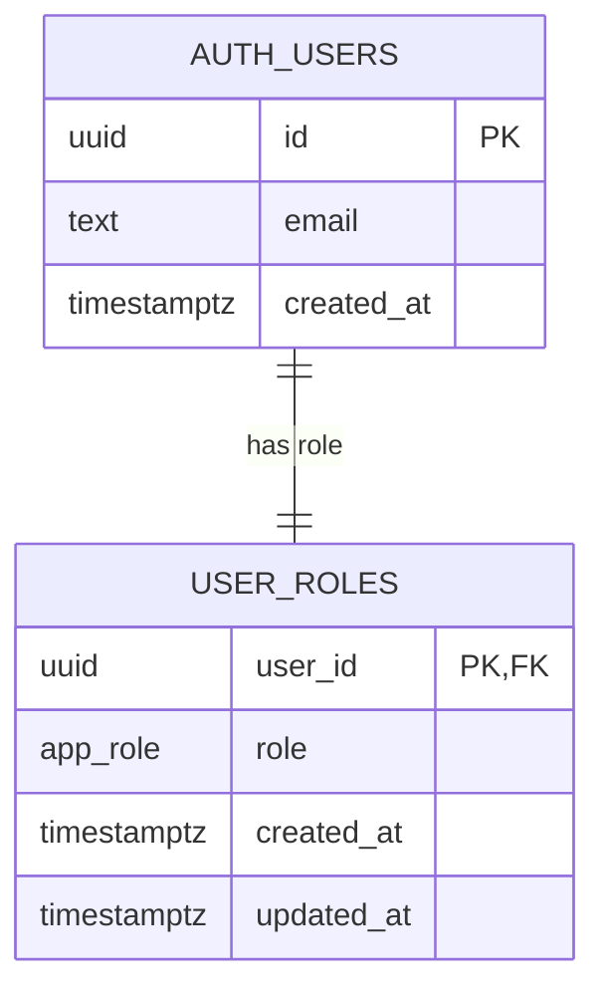

### 001_user_roles

```sql
-- Supabase Auth (auth.users, auth.sessions, auth.refresh_tokens, auth.identities)
-- handles email/password auth, OAuth (Google + Facebook), session lifecycle,
-- access_token issuance, refresh_token rotation, and revocation on sign-out natively.
-- Only role assignment requires a custom table.

create type public.app_role as enum ('authenticated_user', 'admin');

create table public.user_roles (
  user_id    uuid        primary key references auth.users(id) on delete cascade,
  role       public.app_role not null default 'authenticated_user',
  created_at timestamptz not null default now(),
  updated_at timestamptz not null default now()
);

-- auto-assign default role on every new Supabase Auth signup (email or OAuth)
create or replace function public.handle_new_user()
returns trigger
language plpgsql
security definer set search_path = public
as $$
begin
  insert into public.user_roles (user_id)
  values (new.id);
  return new;
end;
$$;

create trigger on_auth_user_created
  after insert on auth.users
  for each row execute procedure public.handle_new_user();

-- keep updated_at current on any role change
create or replace function public.set_updated_at()
returns trigger
language plpgsql
as $$
begin
  new.updated_at = now();
  return new;
end;
$$;

create trigger user_roles_updated_at
  before update on public.user_roles
  for each row execute procedure public.set_updated_at();

create index user_roles_role_idx on public.user_roles (role);

alter table public.user_roles enable row level security;

-- authenticated users may read their own role
create policy "user_roles: owner select"
  on public.user_roles
  for select
  using (user_id = auth.uid());

-- Assumption: INSERT, UPDATE, DELETE are intentionally denied for all non-service roles.
-- Admin elevation is done manually via service_role key by a backend/admin process.

-- rollback:
-- drop trigger user_roles_updated_at on public.user_roles;
-- drop trigger on_auth_user_created on auth.users;
-- drop function public.set_updated_at();
-- drop function public.handle_new_user();
-- drop table public.user_roles;
-- drop type public.app_role;
```
