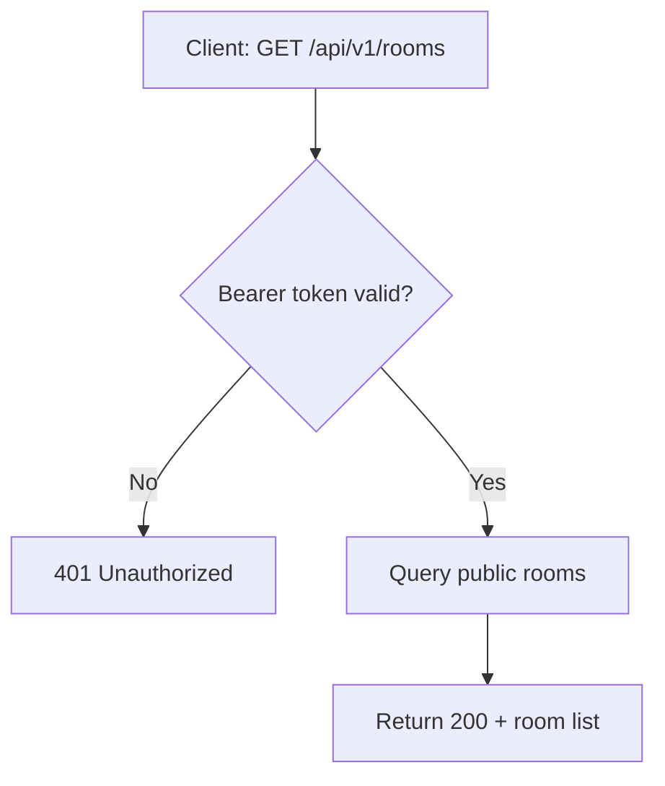
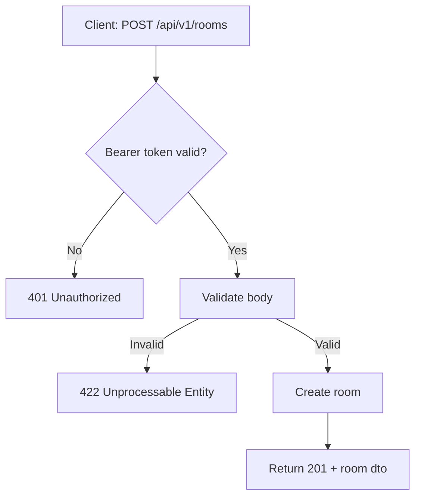
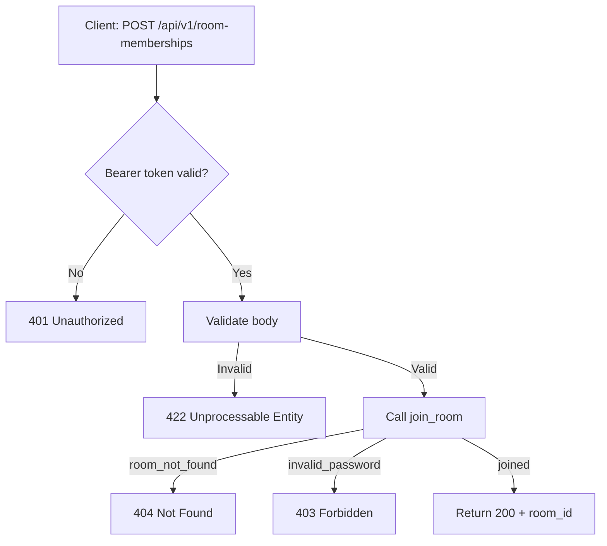

# Backend API Plan — Gaming Module (REST)

---

## Section 1 — Flow Diagrams

Mermaid flowcharts are provided per endpoint in Section 3.

---

## Section 2 — Endpoint Index

| Method | Path | Auth | Summary |
|--------|------|------|---------|
| GET | /api/v1/rooms | Required | List public rooms (rooms wall) |
| POST | /api/v1/rooms | Required | Create a room |
| GET | /api/v1/rooms/{id} | Required | Get room details |
| DELETE | /api/v1/rooms/{id} | Required | Delete room (creator only) |
| POST | /api/v1/room-memberships | Required | Join room by code + optional password |
| GET | /api/v1/rooms/{id}/participants | Required | List room participants (filter + sort) |
| DELETE | /api/v1/rooms/{id}/participants/{userId} | Required | Remove participant (self or creator) |
| GET | /api/v1/rooms/{id}/games | Required | List games in room (filter + sort) |
| POST | /api/v1/rooms/{id}/games | Required | Create game in room |
| GET | /api/v1/games/{id} | Required | Get game details |
| PATCH | /api/v1/games/{id} | Required | Transition game status (creator only) |
| DELETE | /api/v1/games/{id} | Required | Delete game (creator only) |
| POST | /api/v1/games/{id}/participants | Required | Join a game |
| DELETE | /api/v1/games/{id}/participants/{userId} | Required | Leave a game (self only) |
| GET | /api/v1/games/{id}/questions | Required | List questions with options |
| POST | /api/v1/games/{id}/questions | Required | Add question to game (creator only) |
| DELETE | /api/v1/questions/{id} | Required | Delete question (game creator only) |
| POST | /api/v1/questions/{id}/options | Required | Add option to multiple_choice question |
| DELETE | /api/v1/question-options/{id} | Required | Delete question option (game creator only) |
| GET | /api/v1/games/{id}/answers | Required | Get answers (own during pending; all after finished) |
| POST | /api/v1/games/{id}/answers | Required | Submit answer (once per question per player) |
| GET | /api/v1/games/{id}/scores | Required | Get game leaderboard and rankings |

---

## Section 3 — Endpoint Behaviors



```
### GET /api/v1/rooms

Auth: Bearer token required → 401 if missing or invalid
Input: none
Flow: verify auth
      query rooms where is_public = true
      return 200 + room list (no password_hash field)
```



```
### POST /api/v1/rooms

Auth: Bearer token required → 401 if missing or invalid
Input: body { name, is_public, password (optional) }
Flow: verify auth
      validate body → if invalid → 422
      if password provided, hash via pgcrypto
      generate unique room code
      insert room with created_by = caller
      return 201 + room dto (include code, exclude password_hash)
```

```mermaid
flowchart TD
    A[Client: GET /api/v1/rooms/{id}] --> B{Bearer token valid?}
    B -->|No| C[401 Unauthorized]
    B -->|Yes| D[Resolve room]
    D -->|Missing| E[404 Not Found]
    D -->|Found| F{Access allowed?}
    F -->|No| G[403 Forbidden]
    F -->|Yes| H[Return 200 + room dto]
```

```
### GET /api/v1/rooms/{id}

Auth: Bearer token required → 401 if missing or invalid
Input: path param {id}
Flow: verify auth
      resolve room by id → if not found → 404
      check caller is public room OR creator OR room participant → if none → 403
      return 200 + room dto (no password_hash)
```

```mermaid
flowchart TD
    A[Client: DELETE /api/v1/rooms/{id}] --> B{Bearer token valid?}
    B -->|No| C[401 Unauthorized]
    B -->|Yes| D[Resolve room]
    D -->|Missing| E[404 Not Found]
    D -->|Found| F{Caller is creator?}
    F -->|No| G[403 Forbidden]
    F -->|Yes| H[Delete room]
    H --> I[Return 204]
```

```
### DELETE /api/v1/rooms/{id}

Auth: Bearer token required → 401 if missing or invalid
Input: path param {id}
Flow: verify auth
      resolve room by id → if not found → 404
      check caller is creator → if not → 403
      delete room (cascades to participants, games, etc.)
      return 204
```



```
### POST /api/v1/room-memberships

Auth: Bearer token required → 401 if missing or invalid
Input: body { code, password (optional) }
Flow: verify auth
      validate body → if code missing → 422
      call join_room(code, password)
      if room_not_found exception → 404
      if invalid_password exception → 403
      return 200 + { room_id }
```

```mermaid
flowchart TD
    A[Client: GET /api/v1/rooms/{id}/participants] --> B{Bearer token valid?}
    B -->|No| C[401 Unauthorized]
    B -->|Yes| D[Resolve room]
    D -->|Missing| E[404 Not Found]
    D -->|Found| F{Caller is participant?}
    F -->|No| G[403 Forbidden]
    F -->|Yes| H[Query/filter/sort participants]
    H --> I[Return 200 + participants]
```

```
### GET /api/v1/rooms/{id}/participants

Auth: Bearer token required → 401 if missing or invalid
Input: path param {id}; query: filter[user_name], sort[user_name]
Flow: verify auth
      resolve room by id → if not found → 404
      check caller is room participant → if not → 403
      query participants joined to room
      apply user_name filter if provided
      apply user_name sort (asc/desc) if provided
      return 200 + participant list
```

```mermaid
flowchart TD
    A[Client: DELETE /api/v1/rooms/{id}/participants/{userId}] --> B{Bearer token valid?}
    B -->|No| C[401 Unauthorized]
    B -->|Yes| D{Caller is self or creator?}
    D -->|No| E[403 Forbidden]
    D -->|Yes| F[Resolve participant record]
    F -->|Missing| G[404 Not Found]
    F -->|Found| H[Delete participant]
    H --> I[Return 204]
```

```
### DELETE /api/v1/rooms/{id}/participants/{userId}

Auth: Bearer token required → 401 if missing or invalid
Input: path params {id}, {userId}
Flow: verify auth
      check caller is {userId} OR room creator → if neither → 403
      resolve participant record → if not found → 404
      delete participant
      return 204
```

```mermaid
flowchart TD
    A[Client: GET /api/v1/rooms/{id}/games] --> B{Bearer token valid?}
    B -->|No| C[401 Unauthorized]
    B -->|Yes| D[Resolve room]
    D -->|Missing| E[404 Not Found]
    D -->|Found| F{Caller is participant?}
    F -->|No| G[403 Forbidden]
    F -->|Yes| H[Query/filter/sort games]
    H --> I[Return 200 + game list]
```

```
### GET /api/v1/rooms/{id}/games

Auth: Bearer token required → 401 if missing or invalid
Input: path param {id}; query: filter[category], filter[name], sort[order|category|name]
Flow: verify auth
      resolve room by id → if not found → 404
      check caller is room participant → if not → 403
      query games in room
      apply category / name filters if provided
      apply sort by order, category, or name if provided (default: sort_order asc)
      return 200 + game list
```

```mermaid
flowchart TD
    A[Client: POST /api/v1/rooms/{id}/games] --> B{Bearer token valid?}
    B -->|No| C[401 Unauthorized]
    B -->|Yes| D[Resolve room]
    D -->|Missing| E[404 Not Found]
    D -->|Found| F{Caller is participant?}
    F -->|No| G[403 Forbidden]
    F -->|Yes| H[Validate body]
    H -->|Invalid| I[422 Unprocessable Entity]
    H -->|Valid| J[Insert game]
    J --> K[Return 201 + game dto]
```

```
### POST /api/v1/rooms/{id}/games

Auth: Bearer token required → 401 if missing or invalid
Input: path param {id}; body { name, type, category, difficulty, description,
       min_players, max_players, time_per_question }
Flow: verify auth
      resolve room by id → if not found → 404
      check caller is room participant → if not → 403
      validate body (type must be 'casual'; difficulty must be Easy/Medium/Hard;
        min_players 1–30; max_players 1–30; min_players <= max_players) → if invalid → 422
      insert game with status = 'waiting', created_by = caller
      return 201 + game dto
```

```mermaid
flowchart TD
    A[Client: GET /api/v1/games/{id}] --> B{Bearer token valid?}
    B -->|No| C[401 Unauthorized]
    B -->|Yes| D[Resolve game]
    D -->|Missing| E[404 Not Found]
    D -->|Found| F{Caller in room?}
    F -->|No| G[403 Forbidden]
    F -->|Yes| H[Return 200 + game dto]
```

```
### GET /api/v1/games/{id}

Auth: Bearer token required → 401 if missing or invalid
Input: path param {id}
Flow: verify auth
      resolve game by id → if not found → 404
      check caller is room participant of the game's room → if not → 403
      return 200 + game dto
```

```mermaid
flowchart TD
    A[Client: PATCH /api/v1/games/{id}] --> B{Bearer token valid?}
    B -->|No| C[401 Unauthorized]
    B -->|Yes| D[Resolve game]
    D -->|Missing| E[404 Not Found]
    D -->|Found| F{Caller is creator?}
    F -->|No| G[403 Forbidden]
    F -->|Yes| H{Valid status transition?}
    H -->|No| I[422 Unprocessable Entity]
    H -->|Yes| J[Update status]
    J --> K[Return 200 + game dto]
```

```
### PATCH /api/v1/games/{id}

Auth: Bearer token required → 401 if missing or invalid
Input: path param {id}; body { status }
Flow: verify auth
      resolve game by id → if not found → 404
      check caller is game creator → if not → 403
      validate status transition:
        'waiting' → 'pending' (sets started_at)
        'pending' → 'finished' (sets finished_at)
        any other transition → 422
      update game status and relevant timestamps
      return 200 + updated game dto
```

```mermaid
flowchart TD
    A[Client: DELETE /api/v1/games/{id}] --> B{Bearer token valid?}
    B -->|No| C[401 Unauthorized]
    B -->|Yes| D[Resolve game]
    D -->|Missing| E[404 Not Found]
    D -->|Found| F{Caller is creator?}
    F -->|No| G[403 Forbidden]
    F -->|Yes| H[Delete game]
    H --> I[Return 204]
```

```
### DELETE /api/v1/games/{id}

Auth: Bearer token required → 401 if missing or invalid
Input: path param {id}
Flow: verify auth
      resolve game by id → if not found → 404
      check caller is game creator → if not → 403
      delete game (cascades to participants, questions, answers, scores)
      return 204
```

```mermaid
flowchart TD
    A[Client: POST /api/v1/games/{id}/participants] --> B{Bearer token valid?}
    B -->|No| C[401 Unauthorized]
    B -->|Yes| D[Resolve game]
    D -->|Missing| E[404 Not Found]
    D -->|Found| F{Status is waiting?}
    F -->|No| G[422 Unprocessable Entity]
    F -->|Yes| H{Caller in room?}
    H -->|No| I[403 Forbidden]
    H -->|Yes| J[Insert participant if missing]
    J --> K[Return 201]
```

```
### POST /api/v1/games/{id}/participants

Auth: Bearer token required → 401 if missing or invalid
Input: path param {id}
Flow: verify auth
      resolve game by id → if not found → 404
      check game status is 'waiting' → if not → 422
      check caller is room participant of the game's room → if not → 403
      insert game participant for caller (no-op if already joined)
      return 201
```

```mermaid
flowchart TD
    A[Client: DELETE /api/v1/games/{id}/participants/{userId}] --> B{Bearer token valid?}
    B -->|No| C[401 Unauthorized]
    B -->|Yes| D{Caller equals userId?}
    D -->|No| E[403 Forbidden]
    D -->|Yes| F[Resolve participant record]
    F -->|Missing| G[404 Not Found]
    F -->|Found| H[Delete participant]
    H --> I[Return 204]
```

```
### DELETE /api/v1/games/{id}/participants/{userId}

Auth: Bearer token required → 401 if missing or invalid
Input: path params {id}, {userId}
Flow: verify auth
      check caller is {userId} → if not → 403
      resolve game participant record → if not found → 404
      delete participant record
      return 204
```

```mermaid
flowchart TD
    A[Client: GET /api/v1/games/{id}/questions] --> B{Bearer token valid?}
    B -->|No| C[401 Unauthorized]
    B -->|Yes| D[Resolve game]
    D -->|Missing| E[404 Not Found]
    D -->|Found| F{Caller in room?}
    F -->|No| G[403 Forbidden]
    F -->|Yes| H[Query questions + options]
    H --> I[Return 200 + questions]
```

```
### GET /api/v1/games/{id}/questions

Auth: Bearer token required → 401 if missing or invalid
Input: path param {id}
Flow: verify auth
      resolve game by id → if not found → 404
      check caller is room participant of the game's room → if not → 403
      query questions for game ordered by sort_order
      join question_options for each question
      return 200 + question list with nested options
```

```mermaid
flowchart TD
    A[Client: POST /api/v1/games/{id}/questions] --> B{Bearer token valid?}
    B -->|No| C[401 Unauthorized]
    B -->|Yes| D[Resolve game]
    D -->|Missing| E[404 Not Found]
    D -->|Found| F{Caller is creator?}
    F -->|No| G[403 Forbidden]
    F -->|Yes| H[Validate body and options]
    H -->|Invalid| I[422 Unprocessable Entity]
    H -->|Valid| J[Insert question/options]
    J --> K[Return 201 + question dto]
```

```
### POST /api/v1/games/{id}/questions

Auth: Bearer token required → 401 if missing or invalid
Input: path param {id}; body { type, prompt, sort_order, options[] (required when type = multiple_choice) }
Flow: verify auth
      resolve game by id → if not found → 404
      check caller is game creator → if not → 403
      validate body (type in allowed set) → if invalid → 422
      if type = multiple_choice, validate options list is present and non-empty → if not → 422
      insert question
      if type = multiple_choice, insert all options
      return 201 + question dto with options
```

```mermaid
flowchart TD
    A[Client: DELETE /api/v1/questions/{id}] --> B{Bearer token valid?}
    B -->|No| C[401 Unauthorized]
    B -->|Yes| D[Resolve question]
    D -->|Missing| E[404 Not Found]
    D -->|Found| F{Caller is game creator?}
    F -->|No| G[403 Forbidden]
    F -->|Yes| H[Delete question]
    H --> I[Return 204]
```

```
### DELETE /api/v1/questions/{id}

Auth: Bearer token required → 401 if missing or invalid
Input: path param {id}
Flow: verify auth
      resolve question by id → if not found → 404
      check caller is game creator of the question's game → if not → 403
      delete question (cascades to options)
      return 204
```

```mermaid
flowchart TD
    A[Client: POST /api/v1/questions/{id}/options] --> B{Bearer token valid?}
    B -->|No| C[401 Unauthorized]
    B -->|Yes| D[Resolve question]
    D -->|Missing| E[404 Not Found]
    D -->|Found| F{Question is multiple_choice?}
    F -->|No| G[422 Unprocessable Entity]
    F -->|Yes| H{Caller is game creator?}
    H -->|No| I[403 Forbidden]
    H -->|Yes| J[Validate and insert option]
    J --> K[Return 201 + option dto]
```

```
### POST /api/v1/questions/{id}/options

Auth: Bearer token required → 401 if missing or invalid
Input: path param {id}; body { text, is_correct, sort_order }
Flow: verify auth
      resolve question by id → if not found → 404
      check question type is 'multiple_choice' → if not → 422
      check caller is game creator of the question's game → if not → 403
      validate body → if invalid → 422
      insert option
      return 201 + option dto
```

```mermaid
flowchart TD
    A[Client: DELETE /api/v1/question-options/{id}] --> B{Bearer token valid?}
    B -->|No| C[401 Unauthorized]
    B -->|Yes| D[Resolve option]
    D -->|Missing| E[404 Not Found]
    D -->|Found| F{Caller is game creator?}
    F -->|No| G[403 Forbidden]
    F -->|Yes| H[Delete option]
    H --> I[Return 204]
```

```
### DELETE /api/v1/question-options/{id}

Auth: Bearer token required → 401 if missing or invalid
Input: path param {id}
Flow: verify auth
      resolve option by id → if not found → 404
      check caller is game creator of the option's game → if not → 403
      delete option
      return 204
```

```mermaid
flowchart TD
    A[Client: GET /api/v1/games/{id}/answers] --> B{Bearer token valid?}
    B -->|No| C[401 Unauthorized]
    B -->|Yes| D[Resolve game]
    D -->|Missing| E[404 Not Found]
    D -->|Found| F{Caller is participant?}
    F -->|No| G[403 Forbidden]
    F -->|Yes| H{Game pending or finished?}
    H -->|Pending| I[Return caller answers]
    H -->|Finished| J[Return all answers]
```

```
### GET /api/v1/games/{id}/answers

Auth: Bearer token required → 401 if missing or invalid
Input: path param {id}
Flow: verify auth
      resolve game by id → if not found → 404
      check caller is game participant → if not → 403
      if game status = 'pending', return only caller's own answers
      if game status = 'finished', return all participant answers
      return 200 + answer list
```

```mermaid
flowchart TD
    A[Client: POST /api/v1/games/{id}/answers] --> B{Bearer token valid?}
    B -->|No| C[401 Unauthorized]
    B -->|Yes| D[Resolve game]
    D -->|Missing| E[404 Not Found]
    D -->|Found| F{Status is pending?}
    F -->|No| G[422 Unprocessable Entity]
    F -->|Yes| H{Caller is participant?}
    H -->|No| I[403 Forbidden]
    H -->|Yes| J{Answer already exists?}
    J -->|Yes| K[409 Conflict]
    J -->|No| L[Validate and insert answer]
    L --> M[Update score + rank]
    M --> N[Return 201 + answer dto]
```

```
### POST /api/v1/games/{id}/answers

Auth: Bearer token required → 401 if missing or invalid
Input: path param {id}; body { question_id, answer_value }
Flow: verify auth
      resolve game by id → if not found → 404
      check game status is 'pending' → if not → 422
      check caller is game participant → if not → 403
      check no existing answer for this question + caller → if exists → 409
      validate answer_value shape matches question type
        multiple_choice → { option_id } required; text_input → { text } required;
        scale → { value } required; wild_challenge → null accepted
      if invalid → 422
      insert answer with score computed against correct options
      call upsert_game_score to update total score and recompute ranks
      return 201 + answer dto
```

```mermaid
flowchart TD
    A[Client: GET /api/v1/games/{id}/scores] --> B{Bearer token valid?}
    B -->|No| C[401 Unauthorized]
    B -->|Yes| D[Resolve game]
    D -->|Missing| E[404 Not Found]
    D -->|Found| F{Caller is participant?}
    F -->|No| G[403 Forbidden]
    F -->|Yes| H[Query ordered leaderboard]
    H --> I[Return 200 + scores]
```

```
### GET /api/v1/games/{id}/scores

Auth: Bearer token required → 401 if missing or invalid
Input: path param {id}
Flow: verify auth
      resolve game by id → if not found → 404
      check caller is game participant → if not → 403
      query game_scores for game ordered by rank asc
      return 200 + leaderboard list with total_score and rank per participant
```

---

## Section 4 — Server-Contract Zod Schemas (REST Convention)

All endpoints in this plan use the same REST server-contract signature:

```ts
import z from 'zod';

export const schema = () =>
  z.object({
    in: z.object({
      query: z.object({}),
      path: z.object({}),
      payload: z.object({}),
    }),
    out: z.union([
      z.object({
        code: z.literal(200),
      }),
      z.object({
        code: z.literal(400),
        type: z.literal('bad-request'),
        message: z.string(),
      }),
      z.object({
        code: z.literal(500),
        type: z.literal('internal-server'),
        message: z.string(),
      }),
    ]),
  });

export type Schema = z.infer<ReturnType<typeof schema>>;
```

### 4.1 Input Channel Mapping By Endpoint

Use this matrix to decide how `in` is split for each endpoint:

| Endpoint | `in.query` | `in.path` | `in.payload` |
|---|---|---|---|
| `GET /api/v1/rooms` | filters/pagination/sort (optional) | `{}` | `{}` |
| `POST /api/v1/rooms` | `{}` | `{}` | room creation payload |
| `GET /api/v1/rooms/{id}` | `{}` | `{ id }` | `{}` |
| `DELETE /api/v1/rooms/{id}` | `{}` | `{ id }` | `{}` |
| `POST /api/v1/room-memberships` | `{}` | `{}` | `{ code, password? }` |
| `GET /api/v1/rooms/{id}/participants` | participant filter/sort | `{ id }` | `{}` |
| `DELETE /api/v1/rooms/{id}/participants/{userId}` | `{}` | `{ id, userId }` | `{}` |
| `GET /api/v1/rooms/{id}/games` | game filter/sort | `{ id }` | `{}` |
| `POST /api/v1/rooms/{id}/games` | `{}` | `{ id }` | game creation payload |
| `GET /api/v1/games/{id}` | `{}` | `{ id }` | `{}` |
| `PATCH /api/v1/games/{id}` | `{}` | `{ id }` | `{ status }` |
| `DELETE /api/v1/games/{id}` | `{}` | `{ id }` | `{}` |
| `POST /api/v1/games/{id}/participants` | `{}` | `{ id }` | `{}` |
| `DELETE /api/v1/games/{id}/participants/{userId}` | `{}` | `{ id, userId }` | `{}` |
| `GET /api/v1/games/{id}/questions` | `{}` | `{ id }` | `{}` |
| `POST /api/v1/games/{id}/questions` | `{}` | `{ id }` | question creation payload |
| `DELETE /api/v1/questions/{id}` | `{}` | `{ id }` | `{}` |
| `POST /api/v1/questions/{id}/options` | `{}` | `{ id }` | option creation payload |
| `DELETE /api/v1/question-options/{id}` | `{}` | `{ id }` | `{}` |
| `GET /api/v1/games/{id}/answers` | `{}` | `{ id }` | `{}` |
| `POST /api/v1/games/{id}/answers` | `{}` | `{ id }` | answer payload |
| `GET /api/v1/games/{id}/scores` | `{}` | `{ id }` | `{}` |

### 4.2 Concrete Schema Example — `GET /api/v1/rooms/{id}/participants`

```ts
import z from 'zod';

export const schema = () =>
  z.object({
    in: z.object({
      query: z.object({
        filterUserName: z.string().optional(),
        sortUserName: z.enum(['asc', 'desc']).optional(),
      }),
      path: z.object({
        id: z.string().uuid(),
      }),
      payload: z.object({}),
    }),
    out: z.union([
      z.object({
        code: z.literal(200),
        participants: z.array(
          z.object({
            userId: z.string().uuid(),
            userName: z.string(),
          }),
        ),
      }),
      z.object({
        code: z.literal(401),
        type: z.literal('unauthorized'),
        message: z.string(),
      }),
      z.object({
        code: z.literal(403),
        type: z.literal('forbidden'),
        message: z.string(),
      }),
      z.object({
        code: z.literal(404),
        type: z.literal('not-found'),
        message: z.string(),
      }),
      z.object({
        code: z.literal(500),
        type: z.literal('internal-server'),
        message: z.string(),
      }),
    ]),
  });

export type Schema = z.infer<ReturnType<typeof schema>>;
```

### 4.3 Concrete Schema Example — `POST /api/v1/games/{id}/answers`

```ts
import z from 'zod';

const answerValue = z.union([
  z.object({ optionId: z.string().uuid() }),
  z.object({ text: z.string().min(1) }),
  z.object({ value: z.number() }),
  z.null(),
]);

export const schema = () =>
  z.object({
    in: z.object({
      query: z.object({}),
      path: z.object({
        id: z.string().uuid(),
      }),
      payload: z.object({
        questionId: z.string().uuid(),
        answerValue,
      }),
    }),
    out: z.union([
      z.object({
        code: z.literal(201),
        answerId: z.string().uuid(),
      }),
      z.object({
        code: z.literal(401),
        type: z.literal('unauthorized'),
        message: z.string(),
      }),
      z.object({
        code: z.literal(403),
        type: z.literal('forbidden'),
        message: z.string(),
      }),
      z.object({
        code: z.literal(404),
        type: z.literal('not-found'),
        message: z.string(),
      }),
      z.object({
        code: z.literal(409),
        type: z.literal('conflict'),
        message: z.string(),
      }),
      z.object({
        code: z.literal(422),
        type: z.literal('validation-error'),
        message: z.string(),
      }),
      z.object({
        code: z.literal(500),
        type: z.literal('internal-server'),
        message: z.string(),
      }),
    ]),
  });

export type Schema = z.infer<ReturnType<typeof schema>>;
```

### 4.4 Convention Rules For This Plan

- Keep all three channels (`query`, `path`, `payload`) in every REST endpoint schema.
- Unused channel must be `z.object({})` to preserve consistent contract shape.
- `in.path` carries route parameters only.
- `in.query` carries filtering/sorting/pagination only.
- `in.payload` carries request body fields only.
- `out` must always be a `z.union` of literal status-code variants.
