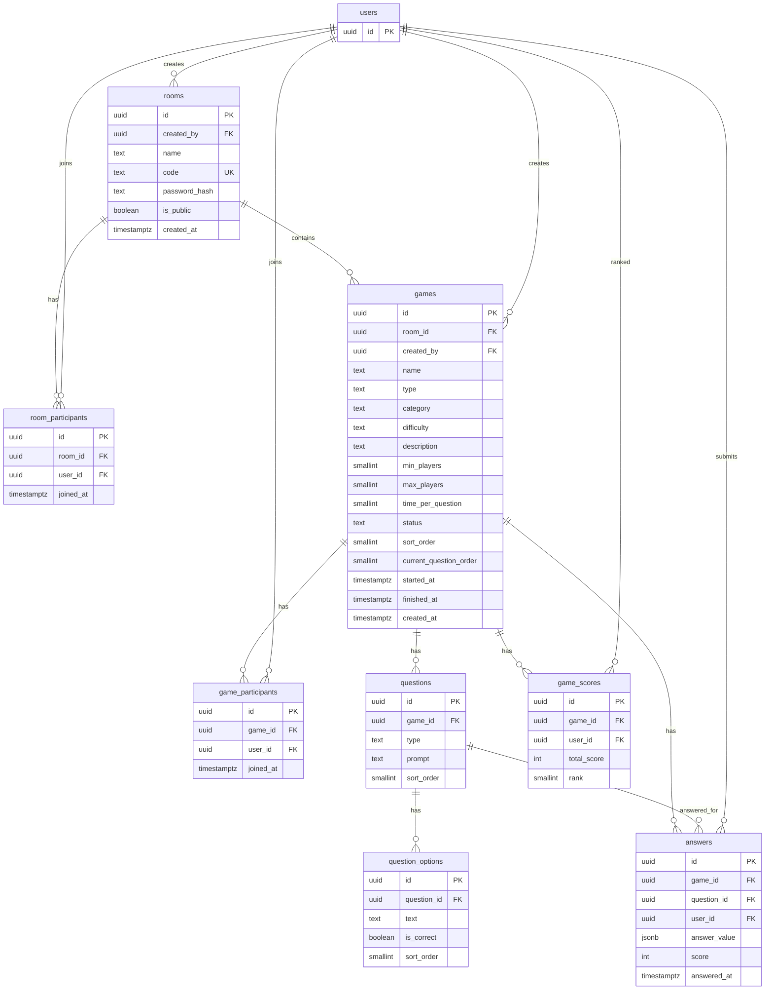

### 000_helpers

```sql
create extension if not exists pgcrypto;

create or replace function public.is_room_member(p_room_id uuid)
returns boolean
language sql
stable
security definer
set search_path = ''
as $$
  select exists (
    select 1
    from public.room_participants
    where room_id = p_room_id and user_id = (select auth.uid())
  );
$$;

create or replace function public.is_game_participant(p_game_id uuid)
returns boolean
language sql
stable
security definer
set search_path = ''
as $$
  select exists (
    select 1
    from public.game_participants
    where game_id = p_game_id and user_id = (select auth.uid())
  );
$$;

create or replace function public.join_room(p_code text, p_password text default null)
returns uuid
language plpgsql
security definer
set search_path = ''
as $$
declare
  v_room_id uuid;
  v_password_hash text;
begin
  select id, password_hash into v_room_id, v_password_hash
  from public.rooms
  where code = p_code;

  if v_room_id is null then
    raise exception 'room_not_found';
  end if;

  if v_password_hash is not null then
    if p_password is null or crypt(p_password, v_password_hash) <> v_password_hash then
      raise exception 'invalid_password';
    end if;
  end if;

  insert into public.room_participants (room_id, user_id)
  values (v_room_id, auth.uid())
  on conflict (room_id, user_id) do nothing;

  return v_room_id;
end;
$$;

create or replace function public.upsert_game_score(p_game_id uuid, p_user_id uuid, p_score int)
returns void
language plpgsql
security definer
set search_path = ''
as $$
begin
  insert into public.game_scores (game_id, user_id, total_score)
  values (p_game_id, p_user_id, p_score)
  on conflict (game_id, user_id)
  do update set total_score = excluded.total_score;

  update public.game_scores gs
  set rank = ranked.r
  from (
    select user_id, rank() over (order by total_score desc) as r
    from public.game_scores
    where game_id = p_game_id
  ) ranked
  where gs.game_id = p_game_id and gs.user_id = ranked.user_id;
end;
$$;

revoke execute on function public.is_room_member(uuid) from anon, authenticated, public;
revoke execute on function public.is_game_participant(uuid) from anon, authenticated, public;
revoke execute on function public.join_room(text, text) from anon, authenticated, public;
revoke execute on function public.upsert_game_score(uuid, uuid, int) from anon, authenticated, public;

grant execute on function public.is_room_member(uuid) to service_role;
grant execute on function public.is_game_participant(uuid) to service_role;
grant execute on function public.join_room(text, text) to service_role;
grant execute on function public.upsert_game_score(uuid, uuid, int) to service_role;

-- rollback: drop function if exists public.upsert_game_score(uuid, uuid, int); drop function if exists public.join_room(text, text); drop function if exists public.is_game_participant(uuid); drop function if exists public.is_room_member(uuid); drop extension if exists pgcrypto;
```

### 001_rooms

```sql
create table public.rooms (
  id uuid primary key default gen_random_uuid(),
  created_by uuid not null references auth.users(id) on delete cascade,
  name text not null,
  code text not null unique,
  password_hash text,
  is_public boolean not null default true,
  created_at timestamptz not null default now()
);

create index idx_rooms_is_public on public.rooms (is_public) where is_public = true;
create index idx_rooms_created_by on public.rooms (created_by);

alter table public.rooms enable row level security;
alter table public.rooms force row level security;

revoke all on public.rooms from public, anon, authenticated;
grant select, insert, update, delete on public.rooms to authenticated, service_role;

create policy "rooms_select"
on public.rooms
for select
to authenticated
using (
  is_public = true
  or created_by = (select auth.uid())
  or (select public.is_room_member(id))
);

create policy "rooms_insert"
on public.rooms
for insert
to authenticated
with check (created_by = (select auth.uid()));

create policy "rooms_update"
on public.rooms
for update
to authenticated
using (created_by = (select auth.uid()))
with check (created_by = (select auth.uid()));

create policy "rooms_delete"
on public.rooms
for delete
to authenticated
using (created_by = (select auth.uid()));

-- rollback: drop table if exists public.rooms cascade;
```

### 002_room_participants

```sql
create table public.room_participants (
  id uuid primary key default gen_random_uuid(),
  room_id uuid not null references public.rooms(id) on delete cascade,
  user_id uuid not null references auth.users(id) on delete cascade,
  joined_at timestamptz not null default now(),
  unique (room_id, user_id)
);

create index idx_room_participants_room_id on public.room_participants (room_id);
create index idx_room_participants_user_id on public.room_participants (user_id);

alter table public.room_participants enable row level security;
alter table public.room_participants force row level security;

revoke all on public.room_participants from public, anon, authenticated;
grant select, delete on public.room_participants to authenticated, service_role;

create policy "room_participants_select"
on public.room_participants
for select
to authenticated
using ((select public.is_room_member(room_id)));

create policy "room_participants_insert"
on public.room_participants
for insert
to authenticated
with check (false);

create policy "room_participants_delete"
on public.room_participants
for delete
to authenticated
using (
  user_id = (select auth.uid())
  or exists (
    select 1
    from public.rooms
    where id = room_id and created_by = (select auth.uid())
  )
);

-- rollback: drop table if exists public.room_participants cascade;
-- fk cross-ref: depends on public.rooms
```

### 003_games

```sql
create table public.games (
  id uuid primary key default gen_random_uuid(),
  room_id uuid not null references public.rooms(id) on delete cascade,
  created_by uuid not null references auth.users(id) on delete cascade,
  name text not null,
  type text not null default 'casual' check (type in ('casual')),
  category text not null,
  difficulty text not null check (difficulty in ('Easy', 'Medium', 'Hard')),
  description text,
  min_players smallint not null default 1 check (min_players >= 1 and min_players <= 30),
  max_players smallint not null default 30 check (max_players >= 1 and max_players <= 30),
  time_per_question smallint not null check (time_per_question > 0),
  status text not null default 'waiting' check (status in ('waiting', 'pending', 'finished')),
  sort_order smallint not null default 0,
  current_question_order smallint,
  started_at timestamptz,
  finished_at timestamptz,
  created_at timestamptz not null default now(),
  check (max_players >= min_players)
);

create index idx_games_room_category on public.games (room_id, category);
create index idx_games_room_sort on public.games (room_id, sort_order, category, name);
create index idx_games_created_by on public.games (created_by);
create index idx_games_room_active on public.games (room_id, sort_order) where status != 'finished';

alter table public.games enable row level security;
alter table public.games force row level security;

revoke all on public.games from public, anon, authenticated;
grant select, insert, update, delete on public.games to authenticated, service_role;

create policy "games_select"
on public.games
for select
to authenticated
using ((select public.is_room_member(room_id)));

create policy "games_insert"
on public.games
for insert
to authenticated
with check (
  created_by = (select auth.uid())
  and (select public.is_room_member(room_id))
);

create policy "games_update"
on public.games
for update
to authenticated
using (created_by = (select auth.uid()))
with check (created_by = (select auth.uid()));

create policy "games_delete"
on public.games
for delete
to authenticated
using (created_by = (select auth.uid()));

-- rollback: drop table if exists public.games cascade;
-- fk cross-ref: depends on public.rooms
```

### 004_game_participants

```sql
create table public.game_participants (
  id uuid primary key default gen_random_uuid(),
  game_id uuid not null references public.games(id) on delete cascade,
  user_id uuid not null references auth.users(id) on delete cascade,
  joined_at timestamptz not null default now(),
  unique (game_id, user_id)
);

create index idx_game_participants_game_id on public.game_participants (game_id);
create index idx_game_participants_user_id on public.game_participants (user_id);

alter table public.game_participants enable row level security;
alter table public.game_participants force row level security;

revoke all on public.game_participants from public, anon, authenticated;
grant select, insert, delete on public.game_participants to authenticated, service_role;

create policy "game_participants_select"
on public.game_participants
for select
to authenticated
using (
  exists (
    select 1
    from public.games g
    where g.id = game_id and (select public.is_room_member(g.room_id))
  )
);

create policy "game_participants_insert"
on public.game_participants
for insert
to authenticated
with check (
  user_id = (select auth.uid())
  and exists (
    select 1
    from public.games g
    where g.id = game_id and (select public.is_room_member(g.room_id))
  )
);

create policy "game_participants_delete"
on public.game_participants
for delete
to authenticated
using (user_id = (select auth.uid()));

-- rollback: drop table if exists public.game_participants cascade;
-- fk cross-ref: depends on public.games
```

### 005_questions

```sql
create table public.questions (
  id uuid primary key default gen_random_uuid(),
  game_id uuid not null references public.games(id) on delete cascade,
  type text not null check (type in ('multiple_choice', 'text_input', 'scale', 'wild_challenge')),
  prompt text not null,
  sort_order smallint not null default 0
);

create index idx_questions_game_order on public.questions (game_id, sort_order);

alter table public.questions enable row level security;
alter table public.questions force row level security;

revoke all on public.questions from public, anon, authenticated;
grant select, insert, update, delete on public.questions to authenticated, service_role;

create policy "questions_select"
on public.questions
for select
to authenticated
using (
  exists (
    select 1
    from public.games g
    where g.id = game_id and (select public.is_room_member(g.room_id))
  )
);

create policy "questions_insert"
on public.questions
for insert
to authenticated
with check (
  exists (
    select 1
    from public.games
    where id = game_id and created_by = (select auth.uid())
  )
);

create policy "questions_update"
on public.questions
for update
to authenticated
using (
  exists (
    select 1
    from public.games
    where id = game_id and created_by = (select auth.uid())
  )
)
with check (
  exists (
    select 1
    from public.games
    where id = game_id and created_by = (select auth.uid())
  )
);

create policy "questions_delete"
on public.questions
for delete
to authenticated
using (
  exists (
    select 1
    from public.games
    where id = game_id and created_by = (select auth.uid())
  )
);

-- rollback: drop table if exists public.questions cascade;
-- fk cross-ref: depends on public.games
```

### 006_question_options

```sql
create table public.question_options (
  id uuid primary key default gen_random_uuid(),
  question_id uuid not null references public.questions(id) on delete cascade,
  text text not null,
  is_correct boolean not null default false,
  sort_order smallint not null default 0
);

create index idx_question_options_question_id on public.question_options (question_id);

alter table public.question_options enable row level security;
alter table public.question_options force row level security;

revoke all on public.question_options from public, anon, authenticated;
grant select, insert, update, delete on public.question_options to authenticated, service_role;

create policy "question_options_select"
on public.question_options
for select
to authenticated
using (
  exists (
    select 1
    from public.questions q
    join public.games g on g.id = q.game_id
    where q.id = question_id and (select public.is_room_member(g.room_id))
  )
);

create policy "question_options_insert"
on public.question_options
for insert
to authenticated
with check (
  exists (
    select 1
    from public.questions q
    join public.games g on g.id = q.game_id
    where q.id = question_id and g.created_by = (select auth.uid())
  )
);

create policy "question_options_update"
on public.question_options
for update
to authenticated
using (
  exists (
    select 1
    from public.questions q
    join public.games g on g.id = q.game_id
    where q.id = question_id and g.created_by = (select auth.uid())
  )
)
with check (
  exists (
    select 1
    from public.questions q
    join public.games g on g.id = q.game_id
    where q.id = question_id and g.created_by = (select auth.uid())
  )
);

create policy "question_options_delete"
on public.question_options
for delete
to authenticated
using (
  exists (
    select 1
    from public.questions q
    join public.games g on g.id = q.game_id
    where q.id = question_id and g.created_by = (select auth.uid())
  )
);

-- rollback: drop table if exists public.question_options cascade;
-- fk cross-ref: depends on public.questions
```

### 007_answers

```sql
create table public.answers (
  id uuid primary key default gen_random_uuid(),
  game_id uuid not null references public.games(id) on delete cascade,
  question_id uuid not null references public.questions(id) on delete cascade,
  user_id uuid not null references auth.users(id) on delete cascade,
  answer_value jsonb,
  score int not null default 0,
  answered_at timestamptz not null default now(),
  unique (question_id, user_id)
);

create index idx_answers_question_id on public.answers (question_id);
create index idx_answers_game_user on public.answers (game_id, user_id);
create index idx_answers_answer_value on public.answers using gin (answer_value jsonb_path_ops);

alter table public.answers enable row level security;
alter table public.answers force row level security;

revoke all on public.answers from public, anon, authenticated;
grant select, insert on public.answers to authenticated, service_role;

create policy "answers_select"
on public.answers
for select
to authenticated
using (
  user_id = (select auth.uid())
  or exists (
    select 1
    from public.games
    where id = game_id and status = 'finished'
  )
);

create policy "answers_insert"
on public.answers
for insert
to authenticated
with check (
  user_id = (select auth.uid())
  and (select public.is_game_participant(game_id))
  and exists (
    select 1
    from public.games
    where id = game_id and status = 'pending'
  )
);

-- rollback: drop table if exists public.answers cascade;
-- fk cross-ref: depends on public.games, public.questions
```

### 008_game_scores

```sql
create table public.game_scores (
  id uuid primary key default gen_random_uuid(),
  game_id uuid not null references public.games(id) on delete cascade,
  user_id uuid not null references auth.users(id) on delete cascade,
  total_score int not null default 0,
  rank smallint,
  unique (game_id, user_id)
);

create index idx_game_scores_leaderboard on public.game_scores (game_id, total_score desc);

alter table public.game_scores enable row level security;
alter table public.game_scores force row level security;

revoke all on public.game_scores from public, anon, authenticated;
grant select on public.game_scores to authenticated, service_role;

create policy "game_scores_select"
on public.game_scores
for select
to authenticated
using ((select public.is_game_participant(game_id)));

create policy "game_scores_insert"
on public.game_scores
for insert
to authenticated
with check (false);

create policy "game_scores_update"
on public.game_scores
for update
to authenticated
using (false);

-- rollback: drop table if exists public.game_scores cascade;
-- fk cross-ref: depends on public.games
```
